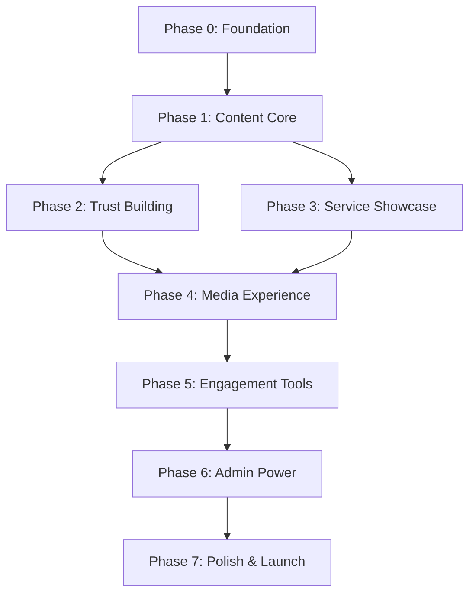

Let us deeply analyze the requirements and re-imagine the architecture and execution strategy for this elderly daycare website. You need to consider:

1. The unique needs of elderly users and their caregivers
2. The practical realities of a newly setup daycare center (likely needs quick MVP, then iterate)
3. How to structure this for autonomous AI agent execution
4. Modern web architecture patterns that will serve this use case best
5. How to balance simplicity with future extensibility

Key insights:
- Elderly users need ultra-simple interfaces, but their adult children (40-65) are tech-savvy
- A new daycare center needs to build trust quickly - social proof is critical
- The admin needs to be simple enough for non-technical staff
- Mobile-first is critical as many caregivers will browse during work breaks
- Video content will be huge for virtual tours and trust-building

## Deep Architecture Analysis & Re-imagination

### Core Architectural Principles for Elderly Daycare Website

After thorough analysis, I propose a **Progressive Disclosure Architecture** that reveals complexity only when needed, combined with a **Trust-First Design Philosophy** that prioritizes emotional connection over feature richness.

### 🏗️ Re-imagined Website Architecture

```
┌─────────────────────────────────────────────────────────┐
│                   PUBLIC LAYER                          │
├─────────────────────────────────────────────────────────┤
│  Home Hub    │  Trust Zone   │  Action Gateway         │
│  (Welcome)   │  (About/Tour) │  (Book/Contact)         │
├─────────────────────────────────────────────────────────┤
│                   CONTENT LAYER                         │
├─────────────────────────────────────────────────────────┤
│  Services    │  Media Hub    │  Resource Library       │
│  (Programs)  │  (Photos/Vid) │  (Guides/FAQ)           │
├─────────────────────────────────────────────────────────┤
│                   INTERACTION LAYER                     │
├─────────────────────────────────────────────────────────┤
│  Livewire    │  Alpine.js    │  Progressive Forms      │
│  Components  │  Interactions │  (Multi-step)           │
├─────────────────────────────────────────────────────────┤
│                   DATA LAYER                            │
├─────────────────────────────────────────────────────────┤
│  Models      │  Services     │  Repositories           │
│  (Eloquent)  │  (Business)   │  (Data Access)          │
└─────────────────────────────────────────────────────────┘
```

### 🎨 Revolutionary Layout Concept: "The Journey Home"

Instead of traditional navigation, we'll use a **narrative-driven layout** that mirrors the emotional journey of finding care for a loved one:

```
1. "Welcome" - Immediate warmth and reassurance
2. "Meet Us" - Build trust through faces and stories  
3. "Experience" - Show daily life through media
4. "Join Us" - Simple, guided enrollment process
5. "Support" - Resources when they need them
```

### 📊 Component Architecture Strategy

```yaml
Component Hierarchy:
  Shell:
    - AppLayout (responsive container)
    - NavigationRail (persistent, simple)
    - ContentStage (main content area)
    - TrustBar (testimonials/certifications)
  
  Smart Components (Livewire):
    - ServiceExplorer (interactive service browser)
    - MediaGallery (lazy-loaded, filterable)
    - BookingWizard (multi-step, state-managed)
    - StaffShowcase (profiles with videos)
    - ResourceFinder (searchable resources)
  
  UI Components (Blade/Alpine):
    - HeroWelcome (emotional first impression)
    - ServiceCard (clear, visual service display)
    - StaffCard (humanizing profiles)
    - TestimonialRotator (social proof)
    - CTAButton (high-contrast, large)
    - VideoPlayer (accessible controls)
    - PhotoLightbox (easy navigation)
```

## 📋 Comprehensive Execution Planning Framework

### Planning Methodology for AI Agent Execution

After careful consideration, the optimal approach is a **Vertical Slice Architecture** where each phase delivers a complete, working feature from database to UI, allowing for immediate value and testing.

### Key Execution Principles

1. **Self-Contained Phases**: Each phase can run in isolation with mock data
2. **Progressive Enhancement**: Each phase adds value without breaking previous work
3. **Test-Driven Checkpoints**: Every phase ends with automated tests
4. **Documentation-as-Code**: Generate docs from code comments
5. **Visual Regression Prevention**: Screenshot tests for UI components

### Phase Dependency Graph



## 🚀 The Actual Execution Plan

---

# **ELDERLY DAYCARE WEBSITE - COMPLETE EXECUTION PLAN**
*For Autonomous AI Agent Implementation*

---

## **PHASE 0: FOUNDATION & INFRASTRUCTURE**
*Estimated Effort: 8-10 hours*

### Objective
Establish a robust, scalable foundation with all core infrastructure components properly configured.

### Detailed Tasks

```markdown
### 0.1 Project Initialization
□ Create directory structure:
  elderly-daycare/
  ├── docker/
  │   ├── apache/
  │   │   └── vhost.conf
  │   ├── php/
  │   │   └── php.ini
  │   └── mysql/
  │       └── init.sql
  ├── docker-compose.yml
  ├── .env.example
  ├── .gitignore
  └── README.md

□ Create docker-compose.yml with:
  - PHP 8.4-fpm-alpine
  - Apache 2.4-alpine  
  - MariaDB 11.8
  - Redis 7.2-alpine (for sessions/cache)
  - Mailhog (for email testing)

□ Configure Apache vhost for Laravel
□ Set up environment variables template
```

```yaml
# docker-compose.yml structure
version: '3.8'
services:
  app:
    build: ./docker/php
    volumes:
      - ./:/var/www/html
    environment:
      - DB_CONNECTION=mysql
      - DB_HOST=db
      - REDIS_HOST=redis
  
  web:
    image: httpd:2.4-alpine
    ports:
      - "80:80"
    volumes:
      - ./:/var/www/html
      - ./docker/apache:/usr/local/apache2/conf
  
  db:
    image: mariadb:11.8
    environment:
      MYSQL_DATABASE: eldercare_db
      MYSQL_ROOT_PASSWORD: secure_password
    volumes:
      - db_data:/var/lib/mysql
  
  redis:
    image: redis:7.2-alpine
    
volumes:
  db_data:
```

### 0.2 Laravel Installation & Configuration

```bash
□ composer create-project laravel/laravel:^12.0 . --prefer-dist
□ php artisan key:generate
□ Configure .env for Docker services
□ php artisan storage:link
□ Set up Laravel Debugbar for development
□ Install core packages:
  - livewire/livewire: ^3.0
  - alpinejs: ^3.0  
  - tailwindcss: ^3.4
  - spatie/laravel-medialibrary: ^11.0
  - spatie/laravel-permission: ^6.0
  - barryvdh/laravel-debugbar: ^3.9
```

### 0.3 Base Configuration

```php
□ Create base service provider
□ Configure session to use Redis
□ Set up cache to use Redis
□ Configure media disk for uploads
□ Set up mail configuration for Mailhog
□ Create base layout files:
  - resources/views/layouts/app.blade.php
  - resources/views/layouts/guest.blade.php
  - resources/views/layouts/admin.blade.php
```

### 0.4 Development Tools Setup

```javascript
□ Configure Vite for asset building
□ Set up Tailwind CSS with elderly-friendly presets:
  - Large default font sizes
  - High contrast color palette
  - Larger click targets
□ Configure Alpine.js
□ Set up hot module replacement
□ Create npm scripts for building
```

### Deliverables Checklist
- [ ] Docker environment runs with `docker-compose up`
- [ ] Laravel welcome page accessible at http://localhost
- [ ] Database migrations run successfully
- [ ] Redis connection verified
- [ ] Assets compile with `npm run dev`
- [ ] Base layouts render correctly
- [ ] Git repository initialized with proper .gitignore

### Validation Tests
```php
// tests/Feature/FoundationTest.php
□ test_application_returns_successful_response()
□ test_database_connection_works()
□ test_redis_cache_works()
□ test_media_disk_is_writable()
```

---

## **PHASE 1: CONTENT CORE & BASIC PAGES**
*Estimated Effort: 12-16 hours*

### Objective
Create the fundamental content structure and primary informational pages that establish the site's presence.

### 1.1 Database Schema & Models

```sql
□ Create migrations:
  - create_services_table
    - id, name, slug, description, short_description
    - schedule, duration, capacity, price
    - features (JSON), requirements (JSON)
    - image_path, icon, sort_order
    - is_featured, is_active
    - meta_title, meta_description
    - timestamps
  
  - create_staff_members_table  
    - id, name, slug, title, bio
    - qualifications (JSON), years_experience
    - photo_path, email, phone
    - specializations (JSON)
    - sort_order, is_active
    - timestamps
  
  - create_testimonials_table
    - id, client_name, relationship
    - content, rating, photo_path
    - service_id (nullable)
    - is_featured, is_active
    - created_at, updated_at
  
  - create_faqs_table
    - id, question, answer
    - category, sort_order
    - is_active, timestamps
```

### 1.2 Eloquent Models & Relationships

```php
□ Create models with relationships:
  - App\Models\Service
    - hasMany testimonials
    - belongsToMany staff_members
    
  - App\Models\StaffMember
    - belongsToMany services
    
  - App\Models\Testimonial
    - belongsTo service (optional)
    
  - App\Models\Faq
    - scopeByCategory()

□ Create model factories for testing
□ Create seeders with realistic elderly care data
```

### 1.3 Public Controllers & Views

```php
□ App\Http\Controllers\HomeController
  - index(): hero, featured services, testimonials
  
□ App\Http\Controllers\ServiceController  
  - index(): list all services
  - show($slug): detailed service page
  
□ App\Http\Controllers\AboutController
  - index(): mission, vision, facility info
  - team(): staff listing
  - staffMember($slug): individual bio
  
□ App\Http\Controllers\ContactController
  - index(): contact form, map, hours
  - submit(): handle form submission
```

### 1.4 Blade Templates (Elderly-Optimized)

```blade
□ Create views:
  - home/index.blade.php
    - Hero with warm imagery
    - 3 featured services (large cards)
    - 2-3 testimonials
    - Clear CTA buttons
    
  - services/index.blade.php
    - Grid of service cards
    - Filter by category
    - Clear pricing display
    
  - services/show.blade.php  
    - Detailed description
    - Schedule table
    - Staff involved
    - Related testimonials
    - Book button
    
  - about/index.blade.php
    - Mission/vision (large text)
    - Facility highlights
    - Certifications
    
  - about/team.blade.php
    - Staff grid with photos
    - Click for bio modal
    
  - contact/index.blade.php
    - Simple contact form
    - Large form fields
    - Google Maps embed
    - Phone with click-to-call
```

### 1.5 Component Library

```blade
□ Create Blade components:
  - <x-service-card :service="$service" />
  - <x-staff-card :member="$member" />
  - <x-testimonial :testimonial="$testimonial" />
  - <x-cta-button :href="$href" :text="$text" />
  - <x-page-header :title="$title" :subtitle="$subtitle" />
  - <x-faq-item :faq="$faq" />
```

### 1.6 Navigation & Layout

```php
□ Create navigation structure:
  - Persistent top nav with large menu items
  - Mobile hamburger menu with full-screen overlay
  - Breadcrumbs on inner pages
  - Footer with quick links, hours, contact
  
□ Implement "Skip to Content" link
□ Add search functionality (basic)
```

### Deliverables Checklist
- [ ] All migrations run successfully
- [ ] Models created with relationships
- [ ] Seeders populate sample data
- [ ] Home page displays with hero and services
- [ ] Services listing and detail pages work
- [ ] About and team pages render
- [ ] Contact form submits (to log for now)
- [ ] Navigation works on desktop and mobile
- [ ] Components are reusable and tested

### Validation Tests
```php
// tests/Feature/ContentTest.php
□ test_home_page_displays_featured_services()
□ test_services_page_lists_all_active_services()
□ test_service_detail_page_shows_correct_info()
□ test_team_page_displays_active_staff()
□ test_contact_form_validates_and_submits()
□ test_navigation_includes_all_main_pages()
```

---

## **PHASE 2: TRUST BUILDING & SOCIAL PROOF**
*Estimated Effort: 10-12 hours*

### Objective
Add dynamic trust-building elements that help families feel confident in choosing the daycare.

### 2.1 Enhanced Testimonials System

```php
□ Create Livewire component:
  - App\Livewire\TestimonialShowcase
    - Rotating display
    - Filter by service
    - Rating display
    - Read more/less functionality
    
□ Video testimonials support:
  - Add video_url field to testimonials
  - Embed YouTube/Vimeo support
  - Thumbnail generation
```

### 2.2 Virtual Facility Tour

```php
□ Create tour page structure:
  - Interactive floor plan (clickable areas)
  - 360° photos if available
  - Regular photo gallery as fallback
  - Descriptions of each area
  
□ App\Http\Controllers\TourController
  - virtual(): tour page
  - area($slug): specific area details
```

### 2.3 Certifications & Accreditations

```php
□ Create certifications table/model
□ Display badges/logos prominently
□ Link to verification if available
□ Add to footer and about page
```

### 2.4 Success Stories / Case Studies

```php
□ Create case_studies table
□ Long-form content support
□ Before/after scenarios
□ Family testimonial integration
```

### 2.5 Trust Indicators

```blade
□ Add trust elements:
  - Years in operation counter
  - Clients served counter
  - Staff-to-client ratio display
  - Security features highlight
  - Insurance/bonding info
```

### Deliverables Checklist
- [ ] Testimonials display dynamically
- [ ] Video testimonials play correctly
- [ ] Virtual tour page is interactive
- [ ] Certifications display prominently
- [ ] Success stories are compelling
- [ ] Trust indicators are visible

### Validation Tests
```php
□ test_testimonial_showcase_rotates()
□ test_video_testimonials_embed_correctly()
□ test_virtual_tour_areas_are_clickable()
□ test_certifications_display_with_links()
```

---

## **PHASE 3: SERVICE SHOWCASE & PROGRAM DETAILS**
*Estimated Effort: 12-14 hours*

### Objective
Create rich, interactive service presentations that help families understand the value and fit.

### 3.1 Dynamic Service Explorer

```php
□ Create Livewire component:
  - App\Livewire\ServiceExplorer
    - Category filtering
    - Search functionality
    - Comparison tool
    - Availability indicator
    
□ Service detail enhancements:
  - Daily schedule timeline
  - Typical day narrative
  - Inclusion/exclusion lists
  - Pricing calculator
```

### 3.2 Program Schedules

```php
□ Create schedules table:
  - service_id, day_of_week
  - start_time, end_time
  - activity_name, description
  
□ Visual schedule display:
  - Calendar view
  - List view
  - Printable version
```

### 3.3 Service Matching Quiz

```php
□ Create Livewire component:
  - App\Livewire\ServiceMatchQuiz
    - Multi-step questionnaire
    - Needs assessment
    - Recommendation engine
    - Results with explanations
```

### 3.4 Pricing & Financial Info

```php
□ Create pricing structure:
  - Base rates
  - Additional services
  - Insurance acceptance
  - Financial assistance info
  
□ Pricing calculator component:
  - Service selection
  - Frequency selection
  - Add-ons
  - Estimated total
```

### Deliverables Checklist
- [ ] Service explorer filters work
- [ ] Service comparison tool functions
- [ ] Schedules display clearly
- [ ] Service quiz provides recommendations
- [ ] Pricing calculator is accurate
- [ ] All interactions are smooth

### Validation Tests
```php
□ test_service_explorer_filters_correctly()
□ test_service_comparison_shows_differences()
□ test_schedule_displays_for_each_service()
□ test_quiz_provides_relevant_recommendations()
□ test_pricing_calculator_computes_correctly()
```

---

## **PHASE 4: MEDIA EXPERIENCE & GALLERY**
*Estimated Effort: 14-16 hours*

### Objective
Create an engaging media experience that brings the daycare to life through photos and videos.

### 4.1 Media Management System

```php
□ Create media tables:
  - media_items: id, type, title, description
  - categories, tags, file_path, thumbnail_path
  - video_duration, is_featured, sort_order
  
□ Implement Spatie MediaLibrary:
  - Image optimization
  - Thumbnail generation
  - Video processing
  - CDN preparation
```

### 4.2 Photo Gallery

```php
□ Create Livewire component:
  - App\Livewire\PhotoGallery
    - Masonry/grid layout
    - Category filtering
    - Lightbox viewing
    - Lazy loading
    - Download options
    
□ Mobile optimizations:
  - Swipe gestures
  - Pinch to zoom
  - Share functionality
```

### 4.3 Video Hub

```php
□ Create video player component:
  - Custom controls for elderly users
  - Subtitle support
  - Speed controls
  - Full-screen mode
  
□ Video categories:
  - Virtual tours
  - Activity highlights
  - Staff introductions
  - Testimonials
  - Educational content
```

### 4.4 Media Integration

```php
□ Add media to services:
  - Service photo galleries
  - Service videos
  
□ Add media to staff profiles:
  - Introduction videos
  - Photo galleries
  
□ Homepage media:
  - Featured video
  - Recent photos widget
```

### Deliverables Checklist
- [ ] Photos upload and process correctly
- [ ] Gallery displays with filtering
- [ ] Lightbox works smoothly
- [ ] Videos play with custom controls
- [ ] Media loads quickly (lazy loading)
- [ ] Mobile experience is optimized

### Validation Tests
```php
□ test_photo_upload_creates_thumbnails()
□ test_gallery_filters_by_category()
□ test_video_player_loads_and_plays()
□ test_lazy_loading_improves_performance()
□ test_mobile_swipe_gestures_work()
```

---

## **PHASE 5: ENGAGEMENT TOOLS & BOOKING**
*Estimated Effort: 16-20 hours*

### Objective
Enable families to take action through booking, inquiries, and engagement tools.

### 5.1 Booking System Foundation

```php
□ Create booking tables:
  - booking_slots: date, time, capacity, booked_count
  - bookings: name, email, phone, slot_id, status
  - booking_services: booking_id, service_id
  
□ Booking rules engine:
  - Capacity management
  - Blackout dates
  - Service prerequisites
  - Conflict detection
```

### 5.2 Multi-Step Booking Wizard

```php
□ Create Livewire component:
  - App\Livewire\BookingWizard
    Step 1: Service selection
    Step 2: Date/time selection
    Step 3: Client information
    Step 4: Medical/special needs
    Step 5: Review & confirm
    
□ Features:
  - Progress indicator
  - Save draft functionality
  - Validation at each step
  - Email confirmation
```

### 5.3 Tour Scheduling

```php
□ Separate tour booking system:
  - In-person tours
  - Virtual tours (Zoom/video call)
  - Group tour options
  - Reminder emails
```

### 5.4 Inquiry Management

```php
□ Enhanced contact forms:
  - Service-specific inquiries
  - Urgency indicators
  - Preferred contact method
  - Best time to call
  
□ Lead tracking:
  - Source tracking
  - Status management
  - Follow-up scheduling
```

### 5.5 Newsletter & Updates

```php
□ Newsletter signup:
  - Interest preferences
  - Family member or professional
  - Email verification
  
□ Update preferences:
  - Service updates
  - Events
  - Educational content
```

### Deliverables Checklist
- [ ] Booking wizard completes full flow
- [ ] Capacity management prevents overbooking
- [ ] Tour scheduling works independently
- [ ] Inquiries route correctly
- [ ] Email confirmations send
- [ ] Newsletter signup functions

### Validation Tests
```php
□ test_booking_wizard_completes_all_steps()
□ test_capacity_limits_are_enforced()
□ test_booking_confirmation_email_sends()
□ test_tour_scheduling_creates_calendar_entry()
□ test_inquiry_form_validates_required_fields()
```

---

## **PHASE 6: ADMIN DASHBOARD & CONTENT MANAGEMENT**
*Estimated Effort: 18-22 hours*

### Objective
Provide staff with powerful yet simple tools to manage all website content and operations.

### 6.1 Admin Authentication & Roles

```php
□ Implement authentication:
  - Email/password login
  - Password reset flow
  - Remember me functionality
  - Session timeout for security
  
□ Role-based access:
  - Super Admin: full access
  - Content Manager: content only
  - Booking Manager: bookings only
  - Staff: own profile only
```

### 6.2 Dashboard Overview

```php
□ Create dashboard widgets:
  - Today's bookings
  - Upcoming tours
  - Recent inquiries
  - Content stats
  - Quick actions menu
  
□ App\Livewire\Admin\Dashboard
  - Real-time updates
  - Customizable layout
  - Export capabilities
```

### 6.3 Content Management

```php
□ Service management:
  - CRUD interface
  - Rich text editor
  - Media attachment
  - SEO fields
  - Preview before publish
  
□ Staff management:
  - Profile editing
  - Photo upload
  - Credential management
  - Service assignments
  
□ Testimonial management:
  - Approval workflow
  - Edit/crop photos
  - Feature selection
  
□ FAQ management:
  - Category organization
  - Reordering
  - Bulk operations
```

### 6.4 Booking Management

```php
□ Booking admin interface:
  - Calendar view
  - List view with filters
  - Status management
  - Client details
  - Notes/comments
  - Export to CSV
  
□ Slot management:
  - Create recurring slots
  - Modify capacity
  - Block dates
  - Holiday management
```

### 6.5 Media Manager

```php
□ Advanced media management:
  - Bulk upload
  - Drag-drop interface
  - Auto-categorization
  - Image editing (crop/rotate)
  - Video thumbnail selection
  - CDN sync status
```

### 6.6 Reports & Analytics

```php
□ Basic reporting:
  - Booking trends
  - Service popularity
  - Inquiry sources
  - Page views
  - Download reports as PDF/Excel
```

### Deliverables Checklist
- [ ] Admin can log in securely
- [ ] Dashboard displays key metrics
- [ ] All content types have CRUD interfaces
- [ ] Booking management is intuitive
- [ ] Media uploads work smoothly
- [ ] Reports generate accurately

### Validation Tests
```php
□ test_admin_authentication_and_authorization()
□ test_dashboard_widgets_display_correct_data()
□ test_content_crud_operations_work()
□ test_booking_management_updates_correctly()
□ test_media_upload_and_processing()
□ test_reports_generate_accurate_data()
```

---

## **PHASE 7: POLISH, OPTIMIZATION & LAUNCH**
*Estimated Effort: 16-20 hours*

### Objective
Refine the entire experience, optimize performance, and prepare for production launch.

### 7.1 Accessibility Audit & Fixes

```blade
□ Accessibility enhancements:
  - Add all missing alt texts
  - Verify ARIA labels
  - Test with screen readers
  - Keyboard navigation testing
  - Color contrast validation
  - Focus indicators
  - Skip navigation links
  
□ Create accessibility statement page
```

### 7.2 Performance Optimization

```php
□ Backend optimizations:
  - Query optimization (N+1 prevention)
  - Eager loading relationships
  - Database indexing
  - Cache implementation (Redis)
  - Queue implementation for emails
  
□ Frontend optimizations:
  - Image optimization pipeline
  - Lazy loading implementation
  - CSS/JS minification
  - Critical CSS inline
  - Service worker for offline
  - CDN configuration
```

### 7.3 SEO Implementation

```php
□ SEO enhancements:
  - Dynamic meta tags
  - Open Graph tags
  - Schema.org markup
  - XML sitemap generation
  - Robots.txt
  - Canonical URLs
  - Page speed optimization
```

### 7.4 Error Handling & User Feedback

```blade
□ Custom error pages:
  - 404 page with suggestions
  - 500 page with contact info
  - Maintenance mode page
  
□ User feedback systems:
  - Success messages
  - Error messages
  - Loading states
  - Progress indicators
  - Confirmation dialogs
```

### 7.5 Security Hardening

```php
□ Security measures:
  - CSRF protection verification
  - XSS prevention
  - SQL injection prevention
  - File upload validation
  - Rate limiting
  - Security headers
  - SSL enforcement
```

### 7.6 Mobile Optimization

```css
□ Mobile-specific enhancements:
  - Touch target sizes (min 44px)
  - Viewport configuration
  - Font size adjustments
  - Button placement
  - Form optimizations
  - Gesture support
```

### 7.7 Documentation & Training

```markdown
□ Create documentation:
  - Admin user manual
  - Content guidelines
  - Technical documentation
  - Deployment guide
  - Backup procedures
  
□ Training materials:
  - Video tutorials
  - Quick reference cards
  - FAQ for admins
```

### 7.8 Testing & QA

```php
□ Comprehensive testing:
  - Unit tests for models
  - Feature tests for workflows
  - Browser tests (Dusk)
  - Cross-browser testing
  - Mobile device testing
  - Load testing
  - Security scanning
```

### 7.9 Deployment Preparation

```yaml
□ Production setup:
  - Environment configuration
  - Database migration strategy
  - Asset compilation
  - Caching strategy
  - Monitoring setup
  - Backup configuration
  - SSL certificates
  
□ Deployment checklist:
  - Pre-launch checklist
  - Launch day checklist
  - Post-launch checklist
```

### Deliverables Checklist
- [ ] Accessibility audit passes WCAG AA
- [ ] Page load times meet targets
- [ ] SEO audit shows green scores
- [ ] Error pages are user-friendly
- [ ] Security scan shows no vulnerabilities
- [ ] Mobile experience is smooth
- [ ] Documentation is complete
- [ ] All tests pass
- [ ] Production environment is ready

### Validation Tests
```php
□ test_accessibility_wcag_compliance()
□ test_page_load_performance_metrics()
□ test_seo_meta_tags_present()
□ test_error_pages_display_correctly()
□ test_security_headers_are_set()
□ test_mobile_responsive_breakpoints()
□ test_production_deployment_checklist()
```

---

## **PHASE 8: POST-LAUNCH ITERATION**
*Ongoing*

### 8.1 Monitoring & Analytics

```php
□ Set up monitoring:
  - Google Analytics 4
  - Error tracking (Sentry)
  - Uptime monitoring
  - Performance monitoring
  - User behavior tracking
```

### 8.2 Feedback Collection

```php
□ Implement feedback mechanisms:
  - User surveys
  - Admin feedback portal
  - A/B testing framework
  - Heat mapping
```

### 8.3 Continuous Improvement

```php
□ Regular updates:
  - Security patches
  - Performance improvements
  - Feature enhancements
  - Content updates
  - Bug fixes
```

---

## Critical Success Factors for AI Agent Execution

### 1. **Execution Order Rules**
- Never skip phases - each builds on the previous
- Complete all tests before moving to next phase
- Document any deviations or blockers

### 2. **Code Quality Standards**
```php
// Every file must include:
- Proper PHPDoc comments
- Type declarations
- Error handling
- Logging where appropriate
- Tests for critical paths
```

### 3. **Testing Requirements**
- Minimum 80% code coverage for models
- All user-facing features must have feature tests
- Critical paths need browser tests

### 4. **Documentation Standards**
- README.md updated with each phase
- API documentation for all endpoints
- Inline comments for complex logic
- Change log maintained

### 5. **Git Workflow**
```bash
# Branch naming
feature/phase-1-content-core
feature/phase-2-trust-building

# Commit message format
[PHASE-X] Component: Description

# Tag releases
v0.1.0-phase-1-complete
v0.2.0-phase-2-complete
```

### 6. **Validation Checkpoints**
After each phase, verify:
1. All tests pass
2. No console errors
3. Mobile responsive
4. Accessibility check
5. Performance baseline met

---

## Project File Structure

```
elderly-daycare/
├── app/
│   ├── Http/
│   │   ├── Controllers/
│   │   │   ├── Admin/
│   │   │   └── Public/
│   │   └── Middleware/
│   ├── Livewire/
│   │   ├── Admin/
│   │   └── Public/
│   ├── Models/
│   ├── Services/
│   └── Repositories/
├── resources/
│   ├── views/
│   │   ├── admin/
│   │   ├── components/
│   │   ├── layouts/
│   │   └── pages/
│   ├── css/
│   └── js/
├── database/
│   ├── migrations/
│   ├── factories/
│   └── seeders/
├── tests/
│   ├── Feature/
│   ├── Unit/
│   └── Browser/
├── public/
│   ├── css/
│   ├── js/
│   └── media/
└── docker/
```

---

## Estimated Timeline

| Phase | Duration | Dependencies |
|-------|----------|--------------|
| Phase 0 | 1-2 days | None |
| Phase 1 | 2-3 days | Phase 0 |
| Phase 2 | 2 days | Phase 1 |
| Phase 3 | 2-3 days | Phase 1 |
| Phase 4 | 2-3 days | Phase 1 |
| Phase 5 | 3-4 days | Phases 1-3 |
| Phase 6 | 3-4 days | Phases 1-5 |
| Phase 7 | 3-4 days | All previous |
| **Total** | **18-25 days** | - |

---

## Success Metrics

Upon completion, the website should achieve:

1. **Performance**
   - Lighthouse Performance Score: >90
   - First Contentful Paint: <1.5s
   - Time to Interactive: <3s

2. **Accessibility**
   - WCAG AA Compliance
   - Keyboard navigable
   - Screen reader compatible

3. **User Experience**
   - Mobile responsive
   - Intuitive navigation
   - Clear CTAs
   - Trust indicators visible

4. **Business Goals**
   - Online booking functional
   - Inquiry forms working
   - Content easily manageable
   - Analytics tracking active

---

This execution plan should provide a complete, unambiguous roadmap for an AI coding agent to build the elderly daycare website from foundation to launch. Each phase is self-contained, testable, and builds progressively toward a polished, production-ready application.
