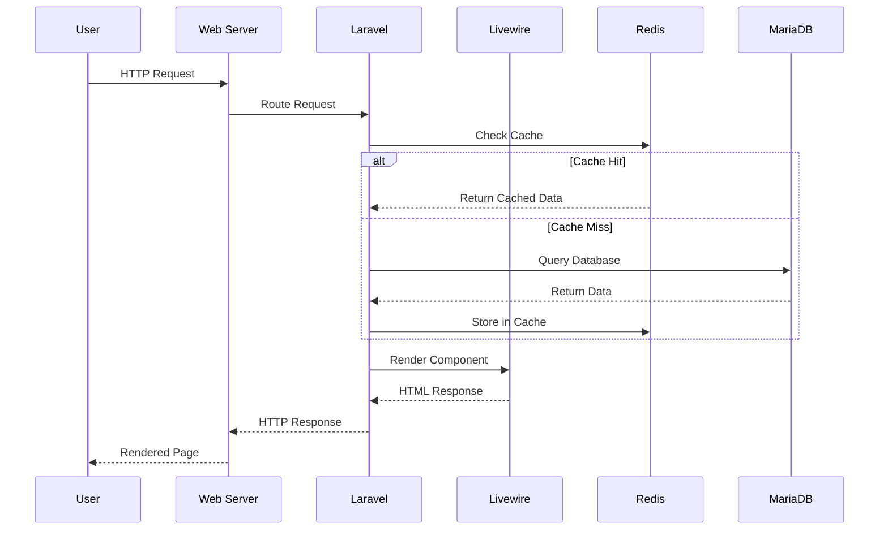
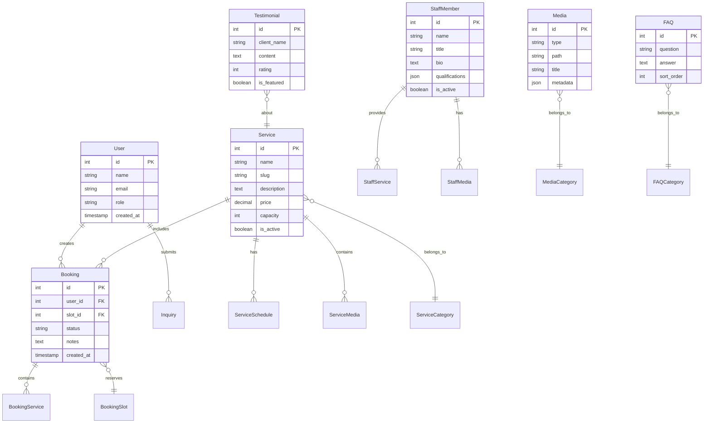
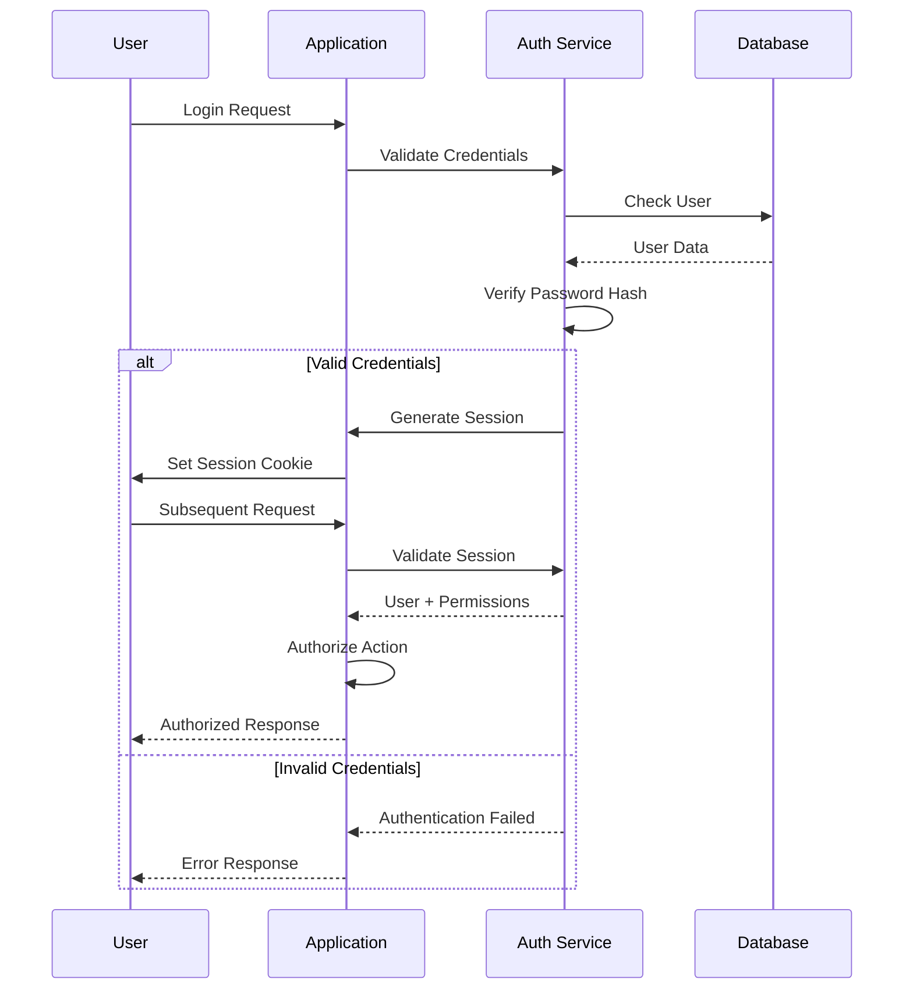

### PROJECT ARCHITECTURE DOCUMENT  
**ElderCare Hub - Technical Architecture Specification**  
Version 1.0.0 | Last Updated: [Current Date]

**Table of Contents**
- Executive Summary  
- System Architecture  
- Technical Stack  
- Data Architecture  
- Application Architecture  
- Frontend Architecture  
- Security Architecture  
- Performance Architecture  
- Deployment Architecture  
- Testing Architecture  
- Accessibility Architecture  
- Monitoring & Observability  
- Architectural Decisions Record  
- Appendices  

---

### Executive Summary

**Project Vision**  
ElderCare Hub is a modern, accessible web platform designed specifically for elderly daycare centers to connect with families, showcase services, and manage bookings. The architecture prioritizes accessibility, simplicity, and trust-building while maintaining technical excellence and scalability.

**Key Architectural Principles**

| Principle | Description | Implementation |
|----------|-------------|----------------|
| Accessibility-First | Every component designed for elderly users and their caregivers | WCAG AA compliance, large touch targets, high contrast |
| Progressive Enhancement | Core functionality works everywhere, enhanced features layer on top | Server-side rendering with Livewire, Alpine.js for interactions |
| Mobile-First Responsive | Optimized for tablets and phones first | Tailwind CSS with custom breakpoints |
| Trust Through Transparency | Architecture supports content that builds confidence | Media-rich, testimonials, virtual tours |
| Simplicity at Scale | Simple for users, scalable for growth | Modular architecture, caching layers |

**Technology Overview**
- **Backend**: Laravel 12 (PHP 8.4) – Mature, well-documented, extensive ecosystem  
- **Frontend**: Livewire 3 + Alpine.js + Tailwind CSS – Reactive without complexity  
- **Database**: MariaDB 11.8 – Reliable, performant, MySQL compatible  
- **Caching**: Redis 7.2 – Fast session management and caching  
- **Infrastructure**: Docker – Consistent environments, easy deployment  

---

### System Architecture

**High-Level Architecture Diagram**

```
┌─────────────────────────────────────────────────────────────────┐
│                         CLIENT LAYER                            │
├─────────────────────────────────────────────────────────────────┤
│  Desktop Browser  │  Mobile Browser  │  Tablet  │  Assistive   │
│                   │                  │          │  Technology  │
└───────────────────┬─────────────────────────────┬──────────────┘
                    │                             │
                    ▼                             ▼
        ┌──────────────────────┐     ┌──────────────────────┐
        │   CDN (Static Assets) │     │   Load Balancer      │
        └──────────┬───────────┘     └──────────┬───────────┘
                   │                             │
                   └──────────┬──────────────────┘
                              ▼
┌─────────────────────────────────────────────────────────────────┐
│                      APPLICATION LAYER                          │
├─────────────────────────────────────────────────────────────────┤
│  ┌─────────────────────────────────────────────────────────┐  │
│  │                  Web Server (Apache 2.4)                 │  │
│  ├─────────────────────────────────────────────────────────┤  │
│  │                Laravel Application (PHP 8.4)             │  │
│  │  ┌──────────┐  ┌──────────┐  ┌──────────┐  ┌─────────┐│  │
│  │  │Controllers│  │ Livewire │  │ Services │  │  Jobs   ││  │
│  │  └──────────┘  └──────────┘  └──────────┘  └─────────┘│  │
│  └─────────────────────────────────────────────────────────┘  │
└─────────────────────────────────────────────────────────────────┘
                              │
                              ▼
┌─────────────────────────────────────────────────────────────────┐
│                        DATA LAYER                               │
├─────────────────────────────────────────────────────────────────┤
│  ┌──────────────┐  ┌──────────────┐  ┌────────────────────┐  │
│  │  MariaDB 11.8 │  │  Redis 7.2   │  │  File Storage      │  │
│  │  (Primary DB) │  │  (Cache)     │  │  (Media/Documents) │  │
│  └──────────────┘  └──────────────┘  └────────────────────┘  │
└─────────────────────────────────────────────────────────────────┘
```

**Component Interaction Flow**



---

### Technical Stack

**Core Technologies**

| Layer | Technology | Version | Justification |
|-------|------------|---------|---------------|
| Language | PHP | 8.4 | Latest stable, excellent performance, strong typing |
| Framework | Laravel | 12.x | Mature ecosystem, excellent documentation, built-in features |
| Database | MariaDB | 11.8 | MySQL compatibility, better performance, active development |
| Cache | Redis | 7.2 | Lightning fast, versatile, session management |
| Frontend | Livewire | 3.0 | Server-side reactivity, no API needed, simpler than SPA |
| JavaScript | Alpine.js | 3.x | Lightweight, perfect companion to Livewire |
| CSS | Tailwind CSS | 3.4 | Utility-first, customizable, excellent responsive tools |
| Web Server | Apache | 2.4 | Mature, well-documented, .htaccess support |
| Container | Docker | Latest | Consistent environments, easy deployment |
| Package Manager | Composer/NPM | Latest | PHP/JS dependency management |

**Supporting Technologies**

| Purpose | Technology | Justification |
|--------|------------|---------------|
| Media Processing | Spatie Media Library | Proven Laravel package, automatic optimization |
| Authentication | Laravel Breeze | Simple, customizable, secure defaults |
| Permissions | Spatie Permissions | Flexible role-based access control |
| SEO | Laravel SEO Tools | Meta tags, sitemaps, Open Graph |
| Testing | PHPUnit / Pest | Comprehensive testing capabilities |
| Browser Testing | Laravel Dusk | Real browser testing for critical paths |
| Monitoring | Laravel Telescope | Development debugging and monitoring |
| Error Tracking | Sentry | Production error tracking and alerting |

---

### Data Architecture

**Entity Relationship Diagram**



**Database Schema Design Principles**
- **Normalization**: 3NF for data integrity, denormalized views for performance  
- **Indexing Strategy**:  
  - Primary keys on all tables  
  - Foreign key indexes for relationships  
  - Composite indexes for common queries  
  - Full-text indexes for search  
- **Data Types**:  
  - Use appropriate MySQL/MariaDB types  
  - JSON columns for flexible data (qualifications, metadata)  
  - TEXT for long content (descriptions, bios)  
  - DECIMAL for prices (never FLOAT)  

**Caching Strategy**

```yaml
Cache Layers:
  Application Cache (Redis):
    - Session data: 2 hours
    - Service listings: 1 hour
    - Staff profiles: 1 hour
    - Media galleries: 30 minutes
    - Testimonials: 1 hour
  Query Cache (Laravel):
    - Database query results: 5-15 minutes
    - Computed values: 30 minutes
  HTTP Cache (Browser):
    - Static assets: 1 year (with versioning)
    - Images: 1 week
    - API responses: 5 minutes
  CDN Cache (Optional):
    - Media files: 1 month
    - CSS/JS: 1 year (with versioning)
```

---

### Application Architecture

**Layer Architecture**

```
┌─────────────────────────────────────────────────────────┐
│                   Presentation Layer                    │
│        (Blade Views, Livewire Components, API)         │
├─────────────────────────────────────────────────────────┤
│                   Application Layer                     │
│    (Controllers, Form Requests, Middleware, Jobs)      │
├─────────────────────────────────────────────────────────┤
│                    Business Layer                       │
│        (Services, Actions, Policies, Events)           │
├─────────────────────────────────────────────────────────┤
│                     Domain Layer                        │
│           (Models, Value Objects, Enums)               │
├─────────────────────────────────────────────────────────┤
│                  Infrastructure Layer                   │
│      (Repositories, External APIs, File System)        │
└─────────────────────────────────────────────────────────┘
```

**Directory Structure**

```
app/
├── Actions/              # Single-purpose action classes
│   ├── Booking/
│   │   ├── CreateBooking.php
│   │   ├── ConfirmBooking.php
│   │   └── CancelBooking.php
│   └── Media/
│       ├── ProcessUpload.php
│       └── GenerateThumbnail.php
├── Console/              # Artisan commands
├── Exceptions/           # Custom exceptions
├── Http/
│   ├── Controllers/
│   │   ├── Admin/       # Admin controllers
│   │   └── Public/      # Public controllers
│   ├── Middleware/
│   └── Requests/        # Form request validation
├── Livewire/
│   ├── Admin/           # Admin Livewire components
│   └── Public/          # Public Livewire components
├── Models/              # Eloquent models
├── Policies/            # Authorization policies
├── Providers/           # Service providers
├── Repositories/        # Data access layer
└── Services/            # Business logic services
    ├── BookingService.php
    ├── MediaService.php
    └── NotificationService.php
```

**Design Patterns**

| Pattern | Usage | Example |
|--------|-------|---------|
| Repository | Data access abstraction | `BookingRepository::findAvailableSlots()` |
| Service | Business logic encapsulation | `BookingService::processReservation()` |
| Action | Single responsibility operations | `CreateBooking::execute($data)` |
| Observer | Model event handling | `BookingObserver::created()` |
| Factory | Complex object creation | `MediaFactory::fromUpload()` |
| Strategy | Interchangeable algorithms | `PaymentStrategy::process()` |

**Service Layer Example**

```php
namespace App\Services;
class BookingService
{
    public function __construct(
        private BookingRepository $repository,
        private NotificationService $notifier,
        private AvailabilityChecker $availability
    ) {}
    public function createBooking(array $data): Booking
    {
        // Business logic validation
        if (!$this->availability->check($data['slot_id'])) {
            throw new SlotUnavailableException();
        }
        // Create booking
        $booking = $this->repository->create($data);
        // Send notifications
        $this->notifier->sendBookingConfirmation($booking);
        // Log event
        event(new BookingCreated($booking));
        return $booking;
    }
}
```

---

### Frontend Architecture

**Component Hierarchy**

```
Layout Components/
├── AppLayout           # Main application shell
├── GuestLayout         # Public pages layout
└── AdminLayout         # Admin panel layout
Page Components/
├── HomePage            # Landing page composition
├── ServicePage         # Service details
├── BookingPage         # Booking wizard
└── GalleryPage         # Media gallery
UI Components/
├── Navigation/
│   ├── MainNav         # Primary navigation
│   ├── MobileNav       # Mobile menu
│   └── Breadcrumbs     # Breadcrumb trail
├── Cards/
│   ├── ServiceCard     # Service display card
│   ├── StaffCard       # Staff member card
│   └── TestimonialCard # Testimonial display
├── Forms/
│   ├── ContactForm     # Contact inquiry
│   ├── BookingForm     # Multi-step booking
│   └── SearchForm      # Search interface
└── Media/
    ├── VideoPlayer     # Accessible video player
    ├── PhotoGallery    # Image gallery
    └── Lightbox        # Media lightbox
```

**Livewire Component Architecture**

```php
// Stateful, reactive component example
namespace App\Livewire;
class BookingWizard extends Component
{
    public int $currentStep = 1;
    public array $formData = [];
    protected $rules = [
        'formData.service_id' => 'required|exists:services,id',
        'formData.date' => 'required|date|after:today',
        'formData.name' => 'required|string|max:255',
        'formData.email' => 'required|email',
    ];
    public function nextStep()
    {
        $this->validateStep();
        $this->currentStep++;
    }
    public function submit()
    {
        $this->validate();
        // Process booking
        $booking = app(BookingService::class)
            ->createBooking($this->formData);
        // Redirect with success
        return redirect()
            ->route('booking.confirmation', $booking);
    }
    public function render()
    {
        return view('livewire.booking-wizard', [
            'services' => Service::active()->get(),
            'availableSlots' => $this->getAvailableSlots(),
        ]);
    }
}
```

**Styling Architecture (Tailwind CSS)**

```javascript
// tailwind.config.js
module.exports = {
  content: [
    './resources/**/*.blade.php',
    './resources/**/*.js',
  ],
  theme: {
    extend: {
      colors: {
        'elderly-primary': '#4A90E2',    // Calming blue
        'elderly-secondary': '#7FBA00',   // Gentle green
        'elderly-warm': '#FFA500',        // Warm orange
        'elderly-text': '#2C3E50',        // High contrast text
        'elderly-bg': '#F8F9FA',          // Soft background
      },
      fontSize: {
        'elderly-base': '1.125rem',       // 18px base
        'elderly-lg': '1.25rem',          // 20px
        'elderly-xl': '1.5rem',           // 24px
      },
      spacing: {
        'touch': '44px',                  // Minimum touch target
      },
    },
  },
  plugins: [
    require('@tailwindcss/forms'),
    require('@tailwindcss/typography'),
  ],
}
```

**Alpine.js Interactions**

```javascript
// Accessible dropdown component
<div x-data="{ open: false }" class="relative">
    <button 
        @click="open = !open"
        @keydown.escape="open = false"
        :aria-expanded="open"
        aria-haspopup="true"
        class="elderly-button"
    >
        Menu
    </button>
    <div 
        x-show="open"
        x-transition
        @click.away="open = false"
        class="absolute dropdown-menu"
        role="menu"
    >
        <!-- Menu items -->
    </div>
</div>
```

---

### Security Architecture

**Security Layers**

```
┌─────────────────────────────────────────────────────────┐
│                   Perimeter Security                    │
│          (Firewall, DDoS Protection, SSL/TLS)          │
├─────────────────────────────────────────────────────────┤
│                  Application Security                   │
│      (Authentication, Authorization, Validation)        │
├─────────────────────────────────────────────────────────┤
│                     Data Security                       │
│        (Encryption, Hashing, Secure Storage)           │
├─────────────────────────────────────────────────────────┤
│                   Infrastructure Security               │
│         (Container Security, Network Isolation)         │
└─────────────────────────────────────────────────────────┘
```

**Authentication & Authorization Flow**



**Security Measures Implementation**

| Threat | Mitigation | Implementation |
|--------|------------|----------------|
| SQL Injection | Parameterized queries | Eloquent ORM, prepared statements |
| XSS | Output escaping | Blade auto-escaping, CSP headers |
| CSRF | Token validation | Laravel CSRF middleware |
| Session Hijacking | Secure cookies | HTTPS-only, HttpOnly, SameSite |
| Brute Force | Rate limiting | Laravel throttle middleware |
| File Upload | Validation & scanning | MIME type check, size limits, antivirus |
| Sensitive Data | Encryption | Encrypted fields, secure transmission |
| Unauthorized Access | RBAC | Policies, gates, middleware |

**Security Headers Configuration**

```php
// Middleware/SecurityHeaders.php
public function handle($request, Closure $next)
{
    $response = $next($request);
    $response->headers->set('X-Content-Type-Options', 'nosniff');
    $response->headers->set('X-Frame-Options', 'SAMEORIGIN');
    $response->headers->set('X-XSS-Protection', '1; mode=block');
    $response->headers->set('Strict-Transport-Security', 'max-age=31536000; includeSubDomains');
    $response->headers->set('Content-Security-Policy', "default-src 'self'; script-src 'self' 'unsafe-inline' 'unsafe-eval' https://cdn.jsdelivr.net; style-src 'self' 'unsafe-inline';");
    $response->headers->set('Referrer-Policy', 'strict-origin-when-cross-origin');
    $response->headers->set('Permissions-Policy', 'camera=(), microphone=(), geolocation=()');
    return $response;
}
```

---

### Performance Architecture

**Performance Optimization Strategy**

```
┌─────────────────────────────────────────────────────────┐
│                   Frontend Optimization                 │
│    (Lazy Loading, Code Splitting, Image Optimization)  │
├─────────────────────────────────────────────────────────┤
│                   Application Optimization              │
│      (Query Optimization, Eager Loading, Caching)      │
├─────────────────────────────────────────────────────────┤
│                   Database Optimization                 │
│        (Indexes, Query Plans, Connection Pooling)      │
├─────────────────────────────────────────────────────────┤
│                  Infrastructure Optimization            │
│         (CDN, Compression, HTTP/2, Keep-Alive)         │
└─────────────────────────────────────────────────────────┘
```

**Performance Metrics & Targets**

| Metric | Target | Critical | Measurement |
|--------|--------|----------|-------------|
| Time to First Byte | <600ms | <1s | Server response time |
| First Contentful Paint | <1.5s | <2.5s | First visual feedback |
| Largest Contentful Paint | <2.5s | <4s | Main content visible |
| Time to Interactive | <3s | <5s | Page fully interactive |
| Cumulative Layout Shift | <0.1 | <0.25 | Visual stability |
| First Input Delay | <100ms | <300ms | Input responsiveness |

**Caching Implementation**

```php
// Service layer caching example
class ServiceRepository
{
    public function getActiveServices(): Collection
    {
        return Cache::remember('services.active', 3600, function () {
            return Service::with(['media', 'testimonials'])
                ->active()
                ->orderBy('sort_order')
                ->get();
        });
    }
    public function clearCache(): void
    {
        Cache::tags(['services'])->flush();
    }
}
```

**Database Query Optimization**

```php
// N+1 prevention with eager loading
$bookings = Booking::with([
    'user:id,name,email',
    'slot:id,date,time',
    'services:id,name,price'
])
->whereDate('created_at', '>=', now()->subDays(30))
->paginate(20);
// Query optimization with indexes
Schema::table('bookings', function (Blueprint $table) {
    $table->index(['status', 'created_at']);
    $table->index(['slot_id', 'status']);
});
```

---

### Deployment Architecture

**Container Architecture**

```yaml
# docker-compose.production.yml
version: '3.8'
services:
  app:
    image: eldercare-app:latest
    environment:
      - APP_ENV=production
      - APP_DEBUG=false
    volumes:
      - storage:/var/www/html/storage
      - cache:/var/www/html/bootstrap/cache
    depends_on:
      - redis
      - db
    restart: unless-stopped
  web:
    image: httpd:2.4-alpine
    ports:
      - "443:443"
      - "80:80"
    volumes:
      - ./docker/apache/ssl:/usr/local/apache2/conf/ssl
      - static:/var/www/html/public
    restart: unless-stopped
  db:
    image: mariadb:11.8
    environment:
      - MYSQL_ROOT_PASSWORD=${DB_PASSWORD}
      - MYSQL_DATABASE=${DB_DATABASE}
    volumes:
      - db_data:/var/lib/mysql
      - ./docker/mysql/conf.d:/etc/mysql/conf.d
    restart: unless-stopped
  redis:
    image: redis:7.2-alpine
    command: redis-server --appendonly yes
    volumes:
      - redis_data:/data
    restart: unless-stopped
  backup:
    image: alpine:latest
    volumes:
      - db_data:/db_data:ro
      - storage:/storage:ro
      - ./backups:/backups
    command: /scripts/backup.sh
volumes:
  db_data:
  redis_data:
  storage:
  cache:
  static:
```

**CI/CD Pipeline**

```yaml
# .github/workflows/deploy.yml
name: Deploy to Production
on:
  push:
    branches: [main]
jobs:
  test:
    runs-on: ubuntu-latest
    steps:
      - uses: actions/checkout@v3
      - name: Setup PHP
        uses: shivammathur/setup-php@v2
        with:
          php-version: '8.4'
      - name: Install Dependencies
        run: composer install
      - name: Run Tests
        run: php artisan test
  build:
    needs: test
    runs-on: ubuntu-latest
    steps:
      - uses: actions/checkout@v3
      - name: Build Docker Image
        run: docker build -t eldercare-app:latest .
      - name: Push to Registry
        run: docker push registry.example.com/eldercare-app:latest
  deploy:
    needs: build
    runs-on: ubuntu-latest
    steps:
      - name: Deploy to Server
        uses: appleboy/ssh-action@master
        with:
          host: ${{ secrets.HOST }}
          username: ${{ secrets.USERNAME }}
          key: ${{ secrets.SSH_KEY }}
          script: |
            cd /var/www/eldercare
            docker-compose pull
            docker-compose up -d
            docker-compose exec app php artisan migrate --force
            docker-compose exec app php artisan cache:clear
```

**Environment Configuration**

```bash
# .env.production
APP_NAME="ElderCare Hub"
APP_ENV=production
APP_DEBUG=false
APP_URL=https://eldercarehub.com
DB_CONNECTION=mysql
DB_HOST=db
DB_PORT=3306
DB_DATABASE=eldercare
DB_USERNAME=eldercare_user
DB_PASSWORD="${DB_PASSWORD}"
CACHE_DRIVER=redis
SESSION_DRIVER=redis
QUEUE_CONNECTION=redis
REDIS_HOST=redis
REDIS_PASSWORD=null
REDIS_PORT=6379
MAIL_MAILER=smtp
MAIL_HOST=smtp.mailgun.org
MAIL_PORT=587
MAIL_USERNAME="${MAIL_USERNAME}"
MAIL_PASSWORD="${MAIL_PASSWORD}"
MAIL_ENCRYPTION=tls
AWS_ACCESS_KEY_ID="${AWS_ACCESS_KEY_ID}"
AWS_SECRET_ACCESS_KEY="${AWS_SECRET_ACCESS_KEY}"
AWS_DEFAULT_REGION=us-east-1
AWS_BUCKET=eldercare-media
SENTRY_LARAVEL_DSN="${SENTRY_DSN}"
```

---

### Testing Architecture

**Testing Pyramid**

```
         ┌─────────┐
        /  E2E     \        5%
       /   Tests    \
      ────────────────
     /  Integration  \      15%
    /     Tests       \
   ─────────────────────
  /    Feature Tests    \   30%
 /                       \
─────────────────────────── 
        Unit Tests          50%
```

**Test Categories**

| Type | Purpose | Tools | Example |
|------|---------|-------|---------|
| Unit | Test individual methods | PHPUnit | `testBookingCalculatesPrice()` |
| Feature | Test complete features | PHPUnit | `testUserCanCreateBooking()` |
| Integration | Test system integration | PHPUnit | `testEmailSendsAfterBooking()` |
| Browser | Test UI interactions | Dusk | `testBookingWizardFlow()` |
| API | Test API endpoints | PHPUnit | `testApiReturnsServices()` |
| Performance | Test load handling | JMeter | `testHandles100ConcurrentUsers()` |

**Testing Standards**

```php
// Test example with proper structure
namespace Tests\Feature;
class BookingTest extends TestCase
{
    use RefreshDatabase;
    protected function setUp(): void
    {
        parent::setUp();
        $this->seed(ServiceSeeder::class);
        $this->user = User::factory()->create();
    }
    /** @test */
    public function user_can_view_available_booking_slots()
    {
        // Arrange
        $service = Service::factory()->create();
        $slots = BookingSlot::factory()->count(5)->create([
            'service_id' => $service->id,
            'date' => now()->addDays(7),
        ]);
        // Act
        $response = $this->actingAs($this->user)
            ->get(route('booking.slots', $service));
        // Assert
        $response->assertOk();
        $response->assertViewHas('slots');
        $this->assertCount(5, $response->viewData('slots'));
    }
}
```

---

### Accessibility Architecture

**WCAG 2.1 AA Compliance Strategy**

```
Perceivable
├── Text alternatives for images
├── Captions for videos
├── Sufficient color contrast (4.5:1 minimum)
└── Resizable text without loss of functionality
Operable
├── Keyboard accessible
├── No seizure-inducing content
├── Sufficient time limits
└── Clear navigation
Understandable
├── Readable text (grade 8 level)
├── Predictable functionality
├── Input assistance
└── Error identification
Robust
├── Valid HTML
├── ARIA labels where needed
├── Compatible with assistive technology
└── Progressive enhancement
```

**Accessibility Implementation**

```blade
<!-- Accessible form example -->
<form role="form" aria-labelledby="booking-form-title">
    <h2 id="booking-form-title">Book Your Visit</h2>
    <div class="form-group">
        <label for="service" class="required">
            Select Service
            <span class="sr-only">(required)</span>
        </label>
        <select 
            id="service" 
            name="service_id" 
            required
            aria-required="true"
            aria-describedby="service-help"
        >
            <option value="">Choose a service...</option>
            @foreach($services as $service)
                <option value="{{ $service->id }}">
                    {{ $service->name }}
                </option>
            @endforeach
        </select>
        <span id="service-help" class="help-text">
            Select the service you're interested in
        </span>
    </div>
    <button 
        type="submit" 
        class="btn btn-primary btn-lg"
        aria-label="Submit booking request"
    >
        Submit Request
    </button>
</form>
```

---

### Monitoring & Observability

**Monitoring Stack**

```
Application Metrics (Laravel Telescope)
├── Request/Response cycles
├── Database queries
├── Cache operations
├── Queue jobs
└── Exceptions
Performance Monitoring (New Relic / DataDog)
├── Application performance
├── Database performance
├── External service calls
└── Custom metrics
Error Tracking (Sentry)
├── Exception capture
├── Error grouping
├── Release tracking
└── User feedback
Uptime Monitoring (UptimeRobot / Pingdom)
├── Endpoint availability
├── Response time
├── SSL certificate expiry
└── Domain expiry
Analytics (Google Analytics 4)
├── User behavior
├── Conversion tracking
├── Device/browser stats
└── Traffic sources
```

**Logging Strategy**

```php
// Structured logging example
Log::channel('bookings')->info('Booking created', [
    'booking_id' => $booking->id,
    'user_id' => $user->id,
    'service_id' => $service->id,
    'slot_date' => $slot->date,
    'total_amount' => $booking->total_amount,
    'ip_address' => request()->ip(),
    'user_agent' => request()->userAgent(),
]);
```

---

### Architectural Decisions Record

**ADR-001: Laravel Framework Selection**  
- **Status**: Accepted  
- **Context**: Need a robust PHP framework for rapid development  
- **Decision**: Use Laravel 12 for its maturity, ecosystem, and built-in features  
- **Consequences**: Faster development, extensive packages available, good documentation  

**ADR-002: Livewire for Reactivity**  
- **Status**: Accepted  
- **Context**: Need reactive UI without SPA complexity  
- **Decision**: Use Livewire 3 for server-side reactivity  
- **Consequences**: Simpler than Vue/React, no API needed, SEO-friendly  

**ADR-003: MariaDB over PostgreSQL**  
- **Status**: Accepted  
- **Context**: Database selection for reliability and performance  
- **Decision**: Use MariaDB for MySQL compatibility and performance  
- **Consequences**: Easier migration from MySQL, good performance, wide support  

**ADR-004: Redis for Caching**  
- **Status**: Accepted  
- **Context**: Need fast caching and session storage  
- **Decision**: Use Redis for all caching needs  
- **Consequences**: Very fast, supports complex data structures, reliable  

**ADR-005: Docker for Containerization**  
- **Status**: Accepted  
- **Context**: Need consistent development and deployment environments  
- **Decision**: Use Docker for all environments  
- **Consequences**: Consistent environments, easier deployment, scalable  

---

### Appendices

**A. Development Setup Commands**

```bash
# Initial setup
git clone https://github.com/eldercare/eldercare-hub.git
cd eldercare-hub
cp .env.example .env
docker-compose up -d
docker-compose exec app composer install
docker-compose exec app php artisan key:generate
docker-compose exec app php artisan migrate --seed
docker-compose exec app npm install
docker-compose exec app npm run dev
```

**B. Common Laravel Commands**

```bash
# Database
php artisan migrate:fresh --seed    # Reset and seed database
php artisan db:seed --class=TestDataSeeder  # Seed specific data
# Cache
php artisan cache:clear             # Clear application cache
php artisan config:cache            # Cache configuration
php artisan route:cache             # Cache routes
php artisan view:cache              # Cache views
# Development
php artisan tinker                  # Interactive shell
php artisan telescope:prune         # Clean old Telescope entries
php artisan queue:work              # Process queue jobs
# Testing
php artisan test                    # Run all tests
php artisan test --parallel         # Run tests in parallel
php artisan dusk                    # Run browser tests
```

**C. Troubleshooting Guide**

| Issue | Solution |
|-------|----------|
| Permission errors | Run `chmod -R 775 storage bootstrap/cache` |
| Database connection refused | Check Docker containers are running |
| Styles not updating | Run `npm run dev` or `npm run build` |
| Cache issues | Run `php artisan cache:clear` |
| Migration errors | Check database credentials in `.env` |
| Memory errors | Increase PHP memory limit in `php.ini` |

**D. Performance Checklist**
- Enable OpCache in production  
- Configure Redis persistence  
- Set up CDN for static assets  
- Enable HTTP/2  
- Configure Gzip compression  
- Optimize images before upload  
- Implement lazy loading  
- Minimize database queries  
- Use database indexes appropriately  
- Cache expensive operations  

**E. Security Checklist**
- HTTPS enabled with valid certificate  
- Security headers configured  
- CSRF protection enabled  
- XSS protection in place  
- SQL injection prevention verified  
- File upload restrictions implemented  
- Rate limiting configured  
- Admin area IP restricted (optional)  
- Regular security updates scheduled  
- Backup strategy implemented  

**Version History**

| Version | Date | Changes | Author |
|---------|------|---------|--------|
| 1.0.0 | [Current] | Initial architecture document | AI Assistant |
