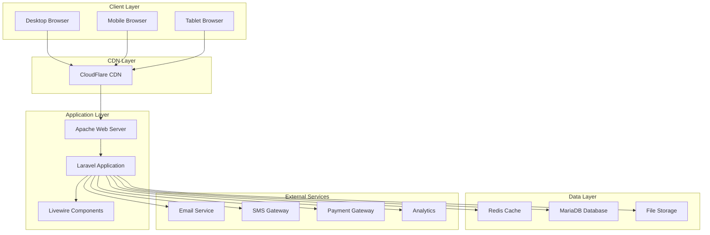
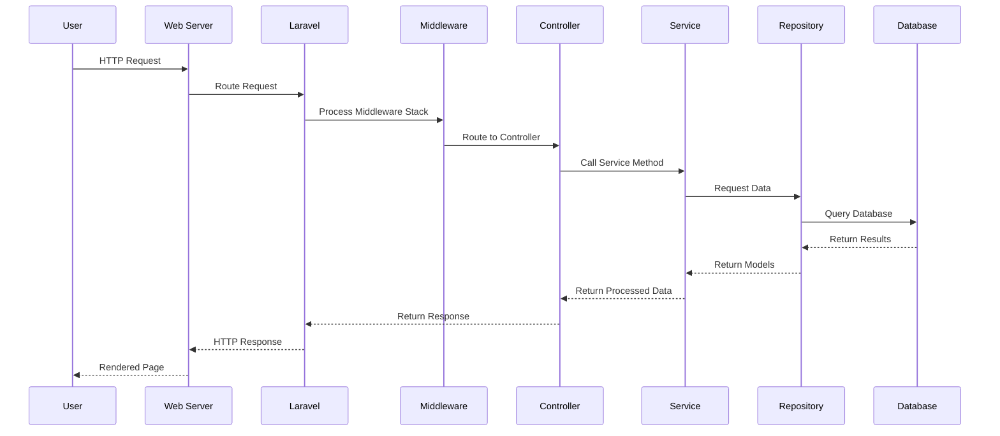
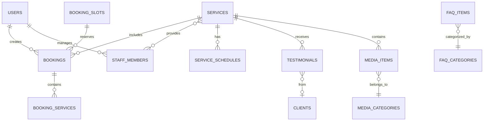
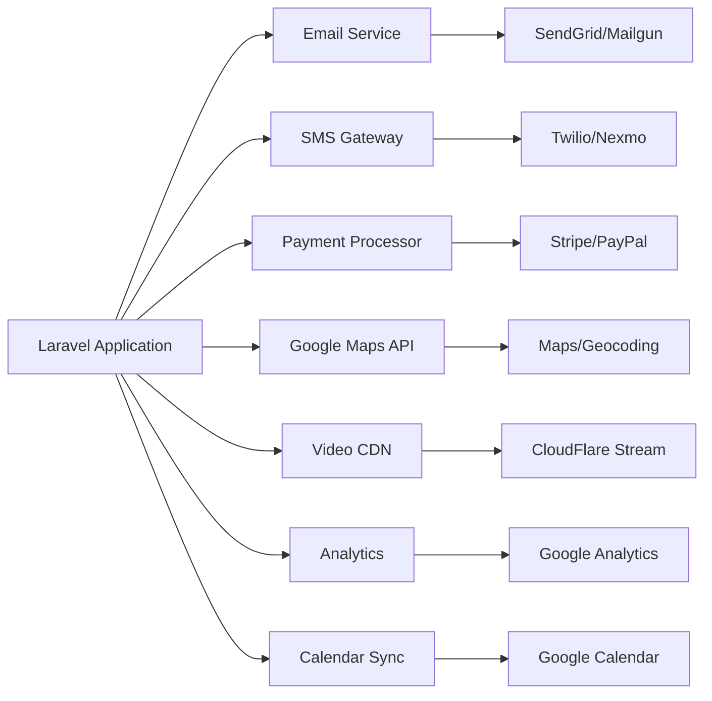

# 📐 PROJECT ARCHITECTURE DOCUMENT

## Elderly Daycare Center Web Platform
### Technical Architecture Blueprint v3.0

---

## 📋 Table of Contents

1. [Executive Summary](#executive-summary)
2. [Architectural Principles](#architectural-principles)
3. [System Architecture](#system-architecture)
4. [Application Architecture](#application-architecture)
5. [Data Architecture](#data-architecture)
6. [Security Architecture](#security-architecture)
7. [Performance Architecture](#performance-architecture)
8. [Integration Architecture](#integration-architecture)
9. [Deployment Architecture](#deployment-architecture)
10. [Development Guidelines](#development-guidelines)
11. [Appendices](#appendices)

---

## Executive Summary

### Project Vision
A **trust-first**, **accessibility-focused** web platform designed specifically for elderly daycare services, prioritizing ease of use for older adults and their caregivers while providing robust administrative capabilities.

### Technical Stack Overview

```yaml
Core Framework:     Laravel 12 (PHP 8.4)
Frontend:          Tailwind CSS 3.4 + Alpine.js 3.0 + Livewire 3.0
Database:          MariaDB 11.8
Cache/Sessions:    Redis 7.2
Server:            Apache 2.4
Containerization:  Docker + Docker Compose
Asset Building:    Vite 5.0
Testing:           PHPUnit + Laravel Dusk
```

### Key Architectural Decisions

| Decision | Rationale | Trade-off |
|----------|-----------|-----------|
| **Monolithic Architecture** | Simplicity, faster initial development, easier deployment for small team | Less scalable than microservices |
| **Server-Side Rendering (SSR)** | Better SEO, faster initial page loads for elderly users, simpler state management | Less interactive than SPA |
| **Livewire for Interactivity** | Progressive enhancement, no API needed, Laravel integration | Requires good server performance |
| **Redis for Cache & Sessions** | Performance, horizontal scaling support, session persistence | Additional infrastructure component |
| **Docker for Development** | Consistent environments, easy onboarding, production parity | Learning curve for non-Docker users |

---

## Architectural Principles

### 1. **Accessibility-First Design**
```
Every architectural decision must consider WCAG 2.1 AA compliance:
- Progressive enhancement over JavaScript dependency
- Semantic HTML as foundation
- Server-side rendering for content
- Graceful degradation for features
```

### 2. **Performance for All Devices**
```
Target Metrics:
├── First Contentful Paint: <1.0s
├── Time to Interactive: <2.5s
├── Cumulative Layout Shift: <0.05
└── Lighthouse Score: >90
```

### 3. **Simplicity Over Complexity**
- Prefer boring technology that works
- Minimize cognitive load for developers
- Use Laravel conventions extensively
- Avoid premature optimization

### 4. **Security by Default**
- All user input is untrusted
- Principle of least privilege
- Defense in depth
- Regular security audits

### 5. **Maintainable & Testable**
- High cohesion, low coupling
- Dependency injection
- Repository pattern for data access
- Service layer for business logic

---

## System Architecture

### High-Level System Overview



### Component Architecture

```
elderly-daycare-platform/
├── Presentation Layer
│   ├── Views (Blade Templates)
│   ├── Livewire Components
│   ├── Alpine.js Components
│   └── API Controllers (Future)
│
├── Application Layer
│   ├── HTTP Controllers
│   ├── Form Requests
│   ├── Middleware
│   └── Console Commands
│
├── Business Logic Layer
│   ├── Services
│   ├── Actions
│   ├── Events
│   └── Listeners
│
├── Data Access Layer
│   ├── Eloquent Models
│   ├── Repositories
│   ├── Query Builders
│   └── Database Migrations
│
└── Infrastructure Layer
    ├── Cache Management
    ├── Queue Workers
    ├── File Storage
    └── External Service Clients
```

---

## Application Architecture

### Laravel Application Structure

```php
app/
├── Actions/                 # Single-purpose action classes
│   ├── Booking/
│   │   ├── CreateBooking.php
│   │   ├── ConfirmBooking.php
│   │   └── CancelBooking.php
│   └── Media/
│       ├── ProcessUploadedVideo.php
│       └── GenerateThumbnails.php
│
├── Http/
│   ├── Controllers/
│   │   ├── Admin/          # Admin panel controllers
│   │   │   ├── DashboardController.php
│   │   │   ├── ServiceController.php
│   │   │   └── BookingController.php
│   │   └── Public/         # Public-facing controllers
│   │       ├── HomeController.php
│   │       ├── ServiceController.php
│   │       └── BookingController.php
│   │
│   ├── Livewire/          # Livewire components
│   │   ├── Admin/
│   │   │   ├── ServiceManager.php
│   │   │   └── BookingCalendar.php
│   │   └── Public/
│   │       ├── BookingWizard.php
│   │       ├── ServiceExplorer.php
│   │       └── MediaGallery.php
│   │
│   └── Middleware/
│       ├── EnsureUserIsAdmin.php
│       ├── CheckUserAge.php
│       └── TrackPageViews.php
│
├── Models/                 # Eloquent models
│   ├── User.php
│   ├── Service.php
│   ├── Booking.php
│   ├── StaffMember.php
│   └── Testimonial.php
│
├── Repositories/          # Data access abstraction
│   ├── ServiceRepository.php
│   ├── BookingRepository.php
│   └── MediaRepository.php
│
└── Services/              # Business logic services
    ├── BookingService.php
    ├── NotificationService.php
    ├── MediaProcessingService.php
    └── ReportingService.php
```

### Request Lifecycle



### Livewire Component Architecture

```php
namespace App\Livewire\Public;

class BookingWizard extends Component
{
    // Component State Management
    public array $steps = [
        'service_selection',
        'date_time_selection', 
        'client_information',
        'special_needs',
        'confirmation'
    ];
    
    public string $currentStep = 'service_selection';
    public array $formData = [];
    
    // Lifecycle Hooks
    public function mount() {}
    public function updated($propertyName) {}
    public function render() {}
    
    // Step Navigation
    public function nextStep() {}
    public function previousStep() {}
    
    // Form Submission
    public function submit() {}
}
```

---

## Data Architecture

### Entity Relationship Diagram



### Core Data Models

#### Services Table
```sql
CREATE TABLE services (
    id BIGINT UNSIGNED PRIMARY KEY,
    name VARCHAR(255) NOT NULL,
    slug VARCHAR(255) UNIQUE NOT NULL,
    description TEXT,
    short_description VARCHAR(500),
    schedule JSON,
    duration INT COMMENT 'in minutes',
    capacity INT DEFAULT 10,
    price DECIMAL(10,2),
    features JSON,
    requirements JSON,
    image_path VARCHAR(500),
    icon VARCHAR(100),
    sort_order INT DEFAULT 0,
    is_featured BOOLEAN DEFAULT FALSE,
    is_active BOOLEAN DEFAULT TRUE,
    meta_title VARCHAR(255),
    meta_description TEXT,
    created_at TIMESTAMP,
    updated_at TIMESTAMP,
    INDEX idx_slug (slug),
    INDEX idx_active_featured (is_active, is_featured),
    FULLTEXT idx_search (name, description)
) ENGINE=InnoDB DEFAULT CHARSET=utf8mb4 COLLATE=utf8mb4_unicode_ci;
```

#### Bookings Table
```sql
CREATE TABLE bookings (
    id BIGINT UNSIGNED PRIMARY KEY,
    booking_number VARCHAR(20) UNIQUE NOT NULL,
    user_id BIGINT UNSIGNED NULL,
    slot_id BIGINT UNSIGNED NOT NULL,
    client_name VARCHAR(255) NOT NULL,
    client_email VARCHAR(255) NOT NULL,
    client_phone VARCHAR(20),
    emergency_contact JSON,
    special_needs TEXT,
    status ENUM('pending', 'confirmed', 'cancelled', 'completed') DEFAULT 'pending',
    confirmation_token VARCHAR(64),
    confirmed_at TIMESTAMP NULL,
    cancelled_at TIMESTAMP NULL,
    cancellation_reason TEXT,
    notes TEXT,
    metadata JSON,
    created_at TIMESTAMP,
    updated_at TIMESTAMP,
    FOREIGN KEY (user_id) REFERENCES users(id) ON DELETE SET NULL,
    FOREIGN KEY (slot_id) REFERENCES booking_slots(id),
    INDEX idx_status_date (status, created_at),
    INDEX idx_booking_number (booking_number),
    INDEX idx_email (client_email)
) ENGINE=InnoDB DEFAULT CHARSET=utf8mb4 COLLATE=utf8mb4_unicode_ci;
```

### Data Access Patterns

```php
// Repository Pattern Implementation
class ServiceRepository
{
    public function findActive(): Collection
    {
        return Cache::remember('services.active', 3600, function () {
            return Service::query()
                ->where('is_active', true)
                ->with(['schedules', 'media'])
                ->orderBy('sort_order')
                ->get();
        });
    }
    
    public function findBySlugWithRelations(string $slug): ?Service
    {
        return Service::query()
            ->where('slug', $slug)
            ->with(['staff', 'testimonials', 'media'])
            ->firstOrFail();
    }
}
```

### Database Optimization Strategies

1. **Indexing Strategy**
   - Primary keys on all tables
   - Foreign key indexes for relationships
   - Composite indexes for common queries
   - Full-text indexes for search

2. **Query Optimization**
   - Eager loading to prevent N+1
   - Query caching for static data
   - Pagination for large datasets
   - Database query monitoring

3. **Data Archival**
   - Soft deletes for audit trail
   - Archive old bookings after 1 year
   - Separate analytics database (future)

---

## Security Architecture

### Security Layers

```
┌─────────────────────────────────────────┐
│         Web Application Firewall        │
├─────────────────────────────────────────┤
│           SSL/TLS Encryption            │
├─────────────────────────────────────────┤
│          Laravel Security Features      │
│  - CSRF Protection                      │
│  - XSS Prevention                       │
│  - SQL Injection Protection             │
├─────────────────────────────────────────┤
│        Authentication & Authorization   │
│  - Session Management                   │
│  - Role-Based Access Control            │
├─────────────────────────────────────────┤
│           Data Protection               │
│  - Encryption at Rest                   │
│  - Input Validation                     │
│  - Output Encoding                      │
└─────────────────────────────────────────┘
```

### Authentication Flow

```php
// Multi-layer authentication
class AuthenticationService
{
    public function authenticate(Request $request): bool
    {
        // 1. Rate limiting
        if ($this->isRateLimited($request->ip())) {
            throw new TooManyAttemptsException();
        }
        
        // 2. Validate credentials
        $credentials = $request->validated();
        
        // 3. Check user status
        $user = User::where('email', $credentials['email'])->first();
        if ($user && $user->is_suspended) {
            throw new AccountSuspendedException();
        }
        
        // 4. Verify password
        if (!Auth::attempt($credentials)) {
            $this->recordFailedAttempt($request);
            return false;
        }
        
        // 5. Setup session
        $request->session()->regenerate();
        
        // 6. Log successful login
        $this->logSuccessfulLogin($user, $request);
        
        return true;
    }
}
```

### Authorization Matrix

| Role | Services | Bookings | Media | Staff | Reports | Settings |
|------|----------|----------|-------|--------|---------|----------|
| **Super Admin** | CRUD | CRUD | CRUD | CRUD | Full | Full |
| **Admin** | CRUD | CRUD | CRUD | CRU | Full | Limited |
| **Staff** | Read | Read/Update | CRU | Read own | Limited | None |
| **Client** | Read | Read own | Read | Read | None | None |

### Security Checklist

```markdown
- [ ] HTTPS enforced on all pages
- [ ] Security headers configured (CSP, HSTS, X-Frame-Options)
- [ ] Input validation on all forms
- [ ] File upload restrictions (type, size, scanning)
- [ ] SQL injection prevention via parameterized queries
- [ ] XSS prevention via output encoding
- [ ] CSRF tokens on all forms
- [ ] Session timeout after 30 minutes of inactivity
- [ ] Password requirements enforced (min 8 chars, complexity)
- [ ] Two-factor authentication available for admins
- [ ] Regular security audits scheduled
- [ ] Audit logging for sensitive operations
- [ ] Data encryption for sensitive fields
- [ ] API rate limiting implemented
- [ ] Error messages don't leak sensitive info
```

---

## Performance Architecture

### Caching Strategy

```php
// Multi-tier caching approach
class CacheStrategy
{
    // L1: Application Cache (Redis)
    const CACHE_TTL = [
        'services.list' => 3600,      // 1 hour
        'staff.list' => 7200,          // 2 hours
        'testimonials' => 1800,        // 30 minutes
        'media.gallery' => 3600,       // 1 hour
        'config.site' => 86400,        // 24 hours
    ];
    
    // L2: HTTP Cache (Browser/CDN)
    const HTTP_CACHE = [
        'images' => 'max-age=31536000, immutable',  // 1 year
        'css' => 'max-age=31536000, immutable',     // 1 year
        'js' => 'max-age=31536000, immutable',      // 1 year
        'pages' => 'max-age=3600, must-revalidate', // 1 hour
    ];
    
    // L3: Database Query Cache
    // Handled by MariaDB query cache
    
    // L4: CDN Cache
    // CloudFlare page rules for static assets
}
```

### Performance Optimization Techniques

#### 1. **Frontend Optimization**
```javascript
// Lazy loading implementation
const lazyLoadImages = () => {
    const imageObserver = new IntersectionObserver((entries, observer) => {
        entries.forEach(entry => {
            if (entry.isIntersecting) {
                const img = entry.target;
                img.src = img.dataset.src;
                img.classList.remove('lazy');
                observer.unobserve(img);
            }
        });
    });
    
    document.querySelectorAll('img.lazy').forEach(img => {
        imageObserver.observe(img);
    });
};
```

#### 2. **Backend Optimization**
```php
// Query optimization example
class OptimizedServiceRepository
{
    public function getServicesWithRelations()
    {
        return Service::query()
            ->select(['id', 'name', 'slug', 'description', 'image_path'])
            ->where('is_active', true)
            ->with([
                'schedules:id,service_id,day,start_time,end_time',
                'staff:id,name,title,photo_path',
                'testimonials' => function ($query) {
                    $query->limit(3)->latest();
                }
            ])
            ->remember(3600) // Cache for 1 hour
            ->get();
    }
}
```

#### 3. **Database Optimization**
```sql
-- Optimized query with proper indexing
EXPLAIN SELECT 
    s.id, s.name, s.slug,
    COUNT(DISTINCT b.id) as booking_count,
    AVG(t.rating) as avg_rating
FROM services s
LEFT JOIN bookings b ON b.service_id = s.id 
    AND b.status = 'confirmed'
    AND b.created_at > DATE_SUB(NOW(), INTERVAL 30 DAY)
LEFT JOIN testimonials t ON t.service_id = s.id 
    AND t.is_active = 1
WHERE s.is_active = 1
GROUP BY s.id
ORDER BY s.sort_order;
```

### Performance Monitoring

```yaml
Metrics to Track:
  Application:
    - Response time (p50, p95, p99)
    - Throughput (requests/second)
    - Error rate
    - Database query time
    
  Frontend:
    - First Contentful Paint
    - Time to Interactive
    - Cumulative Layout Shift
    - JavaScript execution time
    
  Infrastructure:
    - CPU utilization
    - Memory usage
    - Disk I/O
    - Network throughput
    
  Business:
    - Page views
    - Booking conversion rate
    - Video engagement
    - Search queries
```

---

## Integration Architecture

### External Service Integrations



### Integration Patterns

#### 1. **Service Adapter Pattern**
```php
interface NotificationService
{
    public function send(string $recipient, string $message): bool;
}

class EmailNotificationService implements NotificationService
{
    private $mailgun;
    
    public function send(string $recipient, string $message): bool
    {
        try {
            return $this->mailgun->messages()->send([
                'to' => $recipient,
                'subject' => 'Daycare Update',
                'text' => $message
            ]);
        } catch (Exception $e) {
            Log::error('Email failed', ['error' => $e->getMessage()]);
            return false;
        }
    }
}

class SmsNotificationService implements NotificationService
{
    private $twilio;
    
    public function send(string $recipient, string $message): bool
    {
        try {
            return $this->twilio->messages->create($recipient, [
                'from' => config('services.twilio.from'),
                'body' => $message
            ]);
        } catch (Exception $e) {
            Log::error('SMS failed', ['error' => $e->getMessage()]);
            return false;
        }
    }
}
```

#### 2. **Event-Driven Integration**
```php
// Event-based integration for loose coupling
class BookingConfirmed
{
    public function handle(BookingConfirmedEvent $event)
    {
        // Send confirmation email
        dispatch(new SendConfirmationEmail($event->booking));
        
        // Send SMS if requested
        if ($event->booking->wants_sms) {
            dispatch(new SendConfirmationSms($event->booking));
        }
        
        // Sync with calendar
        dispatch(new SyncToCalendar($event->booking));
        
        // Update analytics
        dispatch(new TrackBookingAnalytics($event->booking));
    }
}
```

### API Design (Future)

```yaml
API Endpoints Structure:
  /api/v1:
    /services:
      GET /          # List services
      GET /{id}      # Get service details
    /bookings:
      POST /         # Create booking
      GET /{id}      # Get booking details
      PUT /{id}      # Update booking
      DELETE /{id}   # Cancel booking
    /availability:
      GET /          # Check available slots
    /media:
      GET /          # List media items
      GET /{id}      # Get media details
```

---

## Deployment Architecture

### Infrastructure Overview

```yaml
Production Environment:
  Web Servers:
    - Type: Apache 2.4 with mod_php
    - Count: 2 (load balanced)
    - Specs: 4 vCPU, 8GB RAM
    
  Database:
    - Type: MariaDB 11.8
    - Configuration: Primary-Replica
    - Specs: 4 vCPU, 16GB RAM
    
  Cache/Session:
    - Type: Redis 7.2
    - Configuration: Sentinel for HA
    - Specs: 2 vCPU, 4GB RAM
    
  Storage:
    - Local: Application files
    - S3/Object: Media files
    - Backup: Daily snapshots
    
  CDN:
    - Provider: CloudFlare
    - Cache: Static assets
    - WAF: Enabled
```

### Docker Configuration

```dockerfile
# Dockerfile
FROM php:8.4-apache

# Install PHP extensions
RUN docker-php-ext-install pdo_mysql opcache

# Configure Apache
COPY docker/apache/vhost.conf /etc/apache2/sites-available/000-default.conf
RUN a2enmod rewrite headers

# Install application
COPY . /var/www/html
WORKDIR /var/www/html

# Install dependencies
RUN composer install --no-dev --optimize-autoloader

# Set permissions
RUN chown -R www-data:www-data storage bootstrap/cache

EXPOSE 80
CMD ["apache2-foreground"]
```

### CI/CD Pipeline

```yaml
# .github/workflows/deploy.yml
name: Deploy to Production

on:
  push:
    branches: [main]

jobs:
  test:
    runs-on: ubuntu-latest
    steps:
      - uses: actions/checkout@v2
      - name: Run Tests
        run: |
          composer install
          php artisan test
          
  deploy:
    needs: test
    runs-on: ubuntu-latest
    steps:
      - name: Deploy to Server
        uses: appleboy/ssh-action@master
        with:
          host: ${{ secrets.HOST }}
          username: ${{ secrets.USERNAME }}
          key: ${{ secrets.SSH_KEY }}
          script: |
            cd /var/www/elderly-daycare
            git pull origin main
            composer install --no-dev
            php artisan migrate --force
            php artisan config:cache
            php artisan route:cache
            php artisan view:cache
            php artisan queue:restart
```

### Deployment Checklist

```markdown
Pre-Deployment:
- [ ] All tests passing
- [ ] Security scan completed
- [ ] Performance benchmarks met
- [ ] Database migrations reviewed
- [ ] Rollback plan prepared

Deployment:
- [ ] Maintenance mode enabled
- [ ] Database backed up
- [ ] Code deployed
- [ ] Migrations run
- [ ] Cache cleared and rebuilt
- [ ] Assets compiled and versioned
- [ ] Environment variables verified

Post-Deployment:
- [ ] Smoke tests passed
- [ ] Monitoring alerts configured
- [ ] Performance metrics normal
- [ ] Error logs clean
- [ ] User acceptance verified
```

---

## Development Guidelines

### Coding Standards

```php
/**
 * Follow PSR-12 coding standard
 * Use type declarations
 * Document complex logic
 */
class ServiceController extends Controller
{
    public function __construct(
        private ServiceRepository $repository,
        private CacheManager $cache
    ) {}
    
    public function show(string $slug): View
    {
        $service = $this->cache->remember(
            "service.{$slug}",
            3600,
            fn() => $this->repository->findBySlugWithRelations($slug)
        );
        
        if (!$service) {
            abort(404);
        }
        
        return view('services.show', compact('service'));
    }
}
```

### Testing Standards

```php
class BookingTest extends TestCase
{
    /** @test */
    public function user_can_create_booking_with_valid_data(): void
    {
        // Arrange
        $service = Service::factory()->create();
        $slot = BookingSlot::factory()->available()->create();
        
        // Act
        $response = $this->post('/bookings', [
            'service_id' => $service->id,
            'slot_id' => $slot->id,
            'client_name' => 'John Doe',
            'client_email' => 'john@example.com',
            'client_phone' => '555-0123'
        ]);
        
        // Assert
        $response->assertRedirect('/bookings/confirmation');
        $this->assertDatabaseHas('bookings', [
            'client_email' => 'john@example.com',
            'status' => 'pending'
        ]);
    }
}
```

### Git Workflow

```bash
# Feature branch workflow
git checkout -b feature/phase-1-content-core
git add .
git commit -m "[PHASE-1] Add service listing page"
git push origin feature/phase-1-content-core

# Create pull request for review
# Merge to main after approval
# Tag release
git tag -a v0.1.0 -m "Phase 1 Complete"
git push --tags
```

### Documentation Standards

```markdown
Every module should include:
1. README.md with purpose and usage
2. API documentation (if applicable)
3. Database schema documentation
4. Test coverage report
5. Deployment instructions
```

---

## Appendices

### A. Technology Decision Records

#### ADR-001: Choose Laravel over WordPress
**Status**: Accepted  
**Context**: Need a flexible, maintainable platform  
**Decision**: Use Laravel for custom functionality  
**Consequences**: More development time, better customization  

#### ADR-002: Use Livewire over Vue.js
**Status**: Accepted  
**Context**: Need interactive components without API  
**Decision**: Livewire for server-side reactivity  
**Consequences**: Simpler stack, tighter Laravel integration  

### B. Glossary

| Term | Definition |
|------|------------|
| **SSR** | Server-Side Rendering - HTML generated on server |
| **SPA** | Single Page Application - Client-side rendering |
| **WCAG** | Web Content Accessibility Guidelines |
| **CDN** | Content Delivery Network |
| **CRUD** | Create, Read, Update, Delete operations |
| **HA** | High Availability |
| **WAF** | Web Application Firewall |

### C. Performance Benchmarks

```yaml
Target Metrics:
  Page Load:
    Home: <1.5s
    Service List: <2.0s
    Booking Form: <1.8s
    Media Gallery: <2.5s
    
  API Response:
    List endpoints: <200ms
    Single resource: <100ms
    Create/Update: <300ms
    
  Database Queries:
    Simple SELECT: <10ms
    Complex JOIN: <50ms
    Full-text search: <100ms
```

### D. Security Audit Checklist

```markdown
Weekly:
- [ ] Review failed login attempts
- [ ] Check for unusual traffic patterns
- [ ] Verify backup completion

Monthly:
- [ ] Update dependencies
- [ ] Review user permissions
- [ ] Audit log analysis
- [ ] Security scanner run

Quarterly:
- [ ] Penetration testing
- [ ] SSL certificate renewal check
- [ ] Privacy policy review
- [ ] Compliance audit
