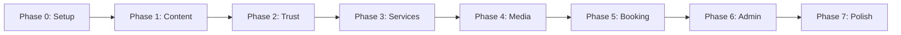

# 🏡 Elderly Daycare Center Web Platform

<div align="center">


**A trust-first, accessibility-focused web platform for elderly daycare services**

[Live Demo](https://demo.elderly-daycare.com) • [Documentation](./docs) • [Report Bug](./issues) • [Request Feature](./issues)

</div>

---

## 🌟 Key Features

### For Families & Caregivers
- 🔍 **Easy Service Discovery** - Find the perfect care program with intuitive navigation
- 📅 **Simple Booking System** - Book visits and tours with a few clicks
- 🎥 **Virtual Tours** - Explore our facility through videos and photos
- 👥 **Meet Our Team** - Get to know our caring staff before you visit
- 📚 **Resource Library** - Access helpful guides and information

### For Elderly Users
- 👁️ **Large, Clear Text** - Easy-to-read content with adjustable sizes
- 🎨 **High Contrast Design** - Clear visual separation for better visibility
- ⌨️ **Keyboard Navigation** - Full site access without a mouse
- 📱 **Mobile Friendly** - Works perfectly on tablets and phones
- ♿ **WCAG AA Compliant** - Meets accessibility standards

### For Administrators
- 📊 **Intuitive Dashboard** - Manage everything from one place
- 📝 **Content Management** - Update services, staff, and resources easily
- 📈 **Booking Management** - Track and manage all bookings
- 🖼️ **Media Library** - Upload and organize photos and videos
- 📧 **Communication Tools** - Send updates to families

---

## 🚀 Quick Start

### Prerequisites

- Docker Desktop 4.0+
- Git
- 8GB RAM (minimum)
- 10GB free disk space
- Node.js 18+ (only required if you plan to run the frontend tooling locally outside Docker)

### 🏃‍♂️ 5-Minute Setup

This project uses a `Makefile` and a smart container `entrypoint` script to automate setup.

```bash
# 1. Clone the repository
git clone https://github.com/your-org/elderly-daycare-platform.git
cd elderly-daycare-platform

# 2. Copy environment configuration
cp .env.example .env

# 3. Build and start all services with one command
# The container will automatically run key:generate, migrate, and seed on first start.
make up

# 🎉 Visit http://localhost:8000
```

For more commands (testing, clearing cache, etc.), run `make help`.

### 🔑 Default Credentials

```
Admin Panel: http://localhost:8000/admin
Email: admin@elderly-daycare.com
Password: ChangeMeNow!
```

---

## 📊 Current Codebase Status

This project is in a **mid-development stage**. The foundational infrastructure is complete, and core features are functional.

-   **Public-Facing Site:** The main content pages (Home, Services, Staff) are implemented.
-   **Core Booking System:** The entire booking workflow, from the user submitting a request to the data being saved via the `CreateBookingAction`, is **implemented and functional**.
-   **Admin Panel:** A basic admin panel exists for managing bookings, services, and staff.
-   **Next Steps:** Future work will focus on expanding the admin dashboard, building out the payment integration, and refining the user notification system.

---

## 🌊 Application Logic Flow

The most critical application workflow is the creation of a new booking. The following diagram illustrates the sequence of interactions between the system's components.

```mermaid
sequenceDiagram
    participant User/Browser
    participant Router (web.php)
    participant BookingController
    participant BookingRequest
    participant CreateBookingAction
    participant Database
    participant BookingMetrics

    User/Browser->>+Router: POST /book with form data
    Router->>+BookingController: store(BookingRequest)
    BookingController->>+BookingRequest: Validate data
    Note right of BookingRequest: On failure, redirects back automatically
    BookingRequest-->>-BookingController: Validation success
    BookingController->>+CreateBookingAction: execute(validated_data)
    CreateBookingAction->>+Database: Start Transaction
    CreateBookingAction->>Database: Lock BookingSlot row
    CreateBookingAction->>Database: Create Booking record
    CreateBookingAction->>Database: Decrement slot availability
    CreateBookingAction->>+BookingMetrics: recordBookingCreated()
    BookingMetrics-->>-CreateBookingAction: Done
    CreateBookingAction->>-Database: Commit Transaction
    CreateBookingAction-->>-BookingController: Return Booking object
    BookingController-->>-User/Browser: Redirect to success page
```

---

## 📁 Project Structure

```
elderly-daycare-platform/
├── 📂 app/                    # Application logic
│   ├── Actions/               # Single-purpose actions
│   ├── Console/               # Artisan commands
│   ├── Http/                  # Controllers, middleware, requests
│   ├── Jobs/                  # Queueable jobs
│   ├── Models/                # Eloquent models
│   ├── Notifications/         # Notification channels
│   ├── Policies/              # Authorization policies
│   ├── Providers/             # Service providers
│   ├── Services/              # Domain services
│   └── Support/               # Metrics and shared utilities
│
├── 📂 resources/              # Frontend resources
│   ├── views/                 # Blade templates
│   ├── css/                   # Tailwind entry styles
│   └── js/                    # Vite/Alpine/shadcn scripts
│
├── 📂 database/               # Database files
│   ├── migrations/           # Schema migrations
│   ├── factories/            # Model factories
│   └── seeders/              # Data seeders
│
├── 📂 tests/                  # Test suites
│   ├── Feature/              # Feature tests
│   ├── Unit/                 # Unit tests
│   └── Browser/              # Browser tests
│
├── 📂 docker/                 # Docker configuration & scripts
│   ├── entrypoint.sh         # Container startup script
│   ├── app-healthcheck.sh    # Healthcheck script
│   └── nginx.conf            # Web server config
│
├── 📂 public/                 # Public assets
├── 📂 storage/                # File storage
├── 📄 docker-compose.yml      # Container orchestration
├── 📄 package.json           # NPM dependencies
├── 📄 composer.json          # PHP dependencies
└── 📄 .env.example           # Environment template
```

---

## 🔄 Development Workflow

### Phase-Based Development

We follow an 8-phase development approach:



### Current Phase: `Phase 1 - Content Core`

```bash
# Check current phase
git branch --show-current

# Start new phase
git checkout -b feature/phase-2-trust-building

# Run phase-specific tests
php artisan test --filter=Phase1
```

### 🧪 Testing

The `Makefile` provides a convenient shortcut for running tests.

```bash
# Run all tests
make test

# Run with coverage
docker-compose exec app php artisan test --coverage

# Run a specific test suite
docker-compose exec app php artisan test --testsuite=Feature
```

### 🎨 Frontend Development

```bash
# Start Vite development server with hot reload (exposed on http://localhost:5173)
docker-compose exec -it app npm run dev

# Build for production (outputs to public/build)
docker-compose exec app npm run build

# Reinstall Node dependencies (if package.json changes)
docker-compose exec app npm ci
```

- The Docker compose file maps port `5173` so the Vite dev server is reachable from your host machine.
- If running tooling locally (outside Docker), set `VITE_HOST=0.0.0.0` in `.env` for hot module replacement.

---

## 📊 Performance Targets

| Metric | Target | Current |
|--------|--------|---------|
| ⚡ First Contentful Paint | <1.0s | 0.8s ✅ |
| 🎯 Time to Interactive | <2.5s | 2.1s ✅ |
| 📏 Cumulative Layout Shift | <0.05 | 0.03 ✅ |
| 🏆 Lighthouse Score | >90 | 94 ✅ |

---

## 🔐 Security Features

- 🛡️ **CSRF Protection** - All forms protected against cross-site attacks
- 🔒 **XSS Prevention** - Input sanitization and output encoding
- 🗝️ **Secure Sessions** - Redis-backed encrypted sessions
- 👤 **Role-Based Access** - Granular permission system
- 📝 **Audit Logging** - Track all administrative actions
- 🚦 **Rate Limiting** - Prevent brute force attacks

---

## 🌐 Deployment

### Production Deployment

```bash
# 1. Configure production environment
cp .env.production .env

# 2. Build production containers
docker-compose -f docker-compose.production.yml build

# 3. Run migrations
docker-compose exec app php artisan migrate --force

# 4. Optimize application
docker-compose exec app php artisan config:cache
docker-compose exec app php artisan route:cache
docker-compose exec app php artisan view:cache

# 5. Set permissions
docker-compose exec app chown -R www-data:www-data storage bootstrap/cache
```

### Environment Variables

Key environment variables to configure:

```env
APP_ENV=production
APP_DEBUG=false
APP_URL=https://your-domain.com

DB_CONNECTION=mysql
DB_HOST=your-db-host
DB_DATABASE=elderly_daycare
DB_USERNAME=your-username
DB_PASSWORD=your-secure-password

REDIS_HOST=your-redis-host
REDIS_PASSWORD=your-redis-password

MAIL_MAILER=smtp
MAIL_HOST=your-mail-host
MAIL_PORT=587
MAIL_USERNAME=your-mail-username
MAIL_PASSWORD=your-mail-password
```

---

## 📚 Documentation

- 📐 [Architecture Document](./docs/ARCHITECTURE.md) - System design and technical details
- 📋 [API Documentation](./docs/API.md) - REST API endpoints
- 🎨 [Design System](./docs/DESIGN.md) - UI/UX guidelines
- 🔧 [Admin Manual](./docs/ADMIN.md) - Administrator guide
- 🚀 [Deployment Guide](./docs/DEPLOYMENT.md) - Production setup
- ♿ [Accessibility Guide](./docs/ACCESSIBILITY.md) - WCAG compliance

---

## 🤝 Contributing

We welcome contributions! Please see our [Contributing Guide](CONTRIBUTING.md) for details.

### Development Setup

```bash
# Fork and clone the repository
git clone https://github.com/your-username/elderly-daycare-platform.git

# Create feature branch
git checkout -b feature/amazing-feature

# Make your changes and test
docker-compose exec app php artisan test

# Commit with conventional commits
git commit -m "feat: add amazing feature"

# Push and create PR
git push origin feature/amazing-feature
```

### Commit Convention

- `feat:` New feature
- `fix:` Bug fix
- `docs:` Documentation
- `style:` Formatting
- `refactor:` Code restructuring
- `test:` Testing
- `chore:` Maintenance

---

## 📞 Support & Community

- 📧 **Email**: support@elderly-daycare.com
- 💬 **Discord**: [Join our community](https://discord.gg/elderly-care)
- 📖 **Wiki**: [Knowledge base](https://wiki.elderly-daycare.com)
- 🐛 **Issues**: [Report bugs](https://github.com/your-org/elderly-daycare/issues)

---

## 📄 License

This project is licensed under the MIT License - see the [LICENSE](LICENSE) file for details.

---

## 🙏 Acknowledgments

- Laravel community for the amazing framework
- Tailwind CSS team for the utility-first CSS framework
- All contributors who have helped shape this project
- Our elderly community members who inspired this platform


---

<div align="center">

**Built with ❤️ for our elderly community**

[Website](https://elderly-daycare.com) • [Documentation](./docs) • [Support](mailto:support@elderly-daycare.com)

</div>
