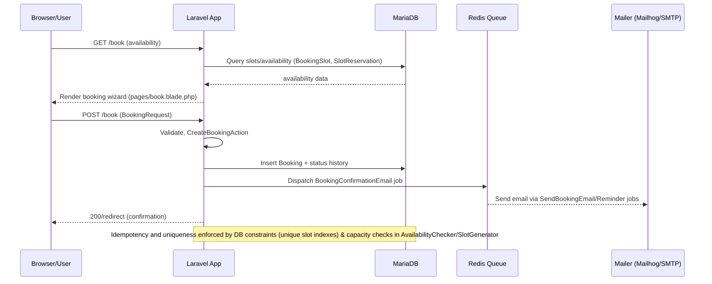
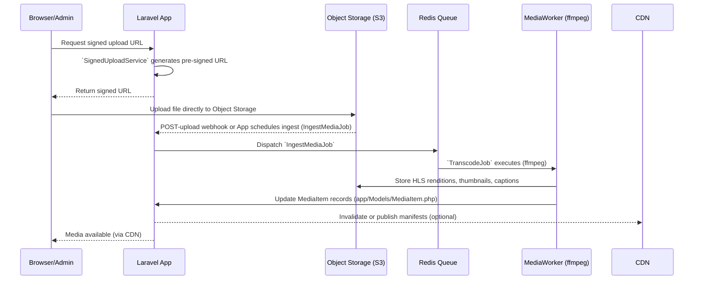
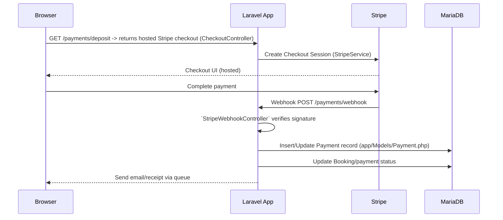

# Understanding Codebase Architecture and Status

This document captures a deep, validated understanding of the project's codebase architecture, runtime layout (Docker + Laravel), main application flows (booking, media, payments), and the current completion/status mapping to repository files. It includes mermaid diagrams to help visualise the system and step-by-step logic flows.

Date: 2025-09-28

## Summary — high level

- Application: Laravel-based monolith (Laravel 12 / PHP 8.x) serving SSR Blade pages and API endpoints. Uses Livewire and Vite in frontend stack (per docs). Codebase includes content, booking, media, payments, notifications, observability and ops modules.
- Runtime: Docker Compose for local/dev. Primary services in compose: `app` (PHP), `mysql` (MariaDB), `redis`, and `mailhog` (dev SMTP). Entrypoint bootstraps Laravel (migrations, storage link, caches) and runs `php artisan` service.
- Background workers: Redis-backed queue with worker jobs for media ingestion/transcode, notifications, reservation sweeps and others.
- External integrations: Object storage (S3-compatible), CDN, Stripe (payments), Prometheus/Grafana (metrics & dashboards), Sentry (errors), SMTP provider for production (Mailhog in dev).

## Contents

- Architecture diagram (high level)
- Application runtime layout (Docker) and bootstrap
- Main logic flows (Booking, Media, Payments) with mermaid flow diagrams
- Component responsibilities & files mapping (validated against repo)
- Observability & CI/test status
- Current completion/status summary (mapped to `codebase_completion_status_report.md`)
- Validation checklist (evidence mapping to actual files)

## Architecture diagram (high-level)

```mermaid
graph LR
  subgraph Local/Container
    App[App: Laravel (PHP) - app container]
    Redis[Redis]
    MySQL[MariaDB]
    Mailhog[Mailhog (dev SMTP)]
  end

  subgraph Workers
    QueueWorker[Queue Workers / Horizon]
    MediaWorker[Media Transcode Workers]
  end

  subgraph External
    ObjectStore[S3-compatible Object Storage]
    CDN[CDN]
    Stripe[Stripe]
    Prometheus[Prometheus]
    Grafana[Grafana]
    Sentry[Sentry]
  end

  Browser -->|HTTP| App
  App -->|PDO| MySQL
  App -->|Redis (sessions, queues, cache)| Redis
  App -->|SMTP| Mailhog
  App -->|Queue jobs| QueueWorker
  App -->|Signed upload URLs / direct uploads| ObjectStore
  ObjectStore --> MediaWorker
  MediaWorker -->|store renditions| ObjectStore
  ObjectStore -->|serve| CDN
  App -->|Payments| Stripe
  App -->|Metrics| Prometheus
  Prometheus --> Grafana
  App --> Sentry
  QueueWorker --> Sentry
  MediaWorker --> Sentry

  style App fill:#f3f4f6,stroke:#111827
  style MySQL fill:#fef3c7,stroke:#92400e
  style Redis fill:#cffafe,stroke:#0369a1
  style ObjectStore fill:#eef2ff,stroke:#3730a3
```

## Application runtime layout & bootstrap (Docker)

- `docker-compose.yml` defines four local services used for development:
  - `app` — built from `Dockerfile`, runs Laravel via `php artisan serve` (compose override sets serve); healthcheck uses `/usr/local/bin/app-healthcheck.sh` which calls `/healthz` endpoint.
  - `mysql` — MariaDB 10.11 with volumes and environment from `.env`.
  - `redis` — used for sessions, cache, and queues.
  - `mailhog` — development SMTP UI.

- `Dockerfile` prepares a PHP runtime (php:8.2-fpm), installs extensions, copies `composer.json`/`composer.lock`, runs `composer install` (no-dev), copies source, and provides an entrypoint.

- `docker/entrypoint.sh` responsibilities:
  - Validate required environment vars
  - Wait for DB and Redis ports
  - Generate `APP_KEY` if missing
  - Ensure `storage` symlink and perms
  - Clear or build Laravel caches depending on environment
  - Run migrations (retries)
  - Verify Redis connectivity
  - Create readiness marker `/tmp/app.ready`

- `docker/app-healthcheck.sh` uses the readiness marker and probes `HEALTHCHECK_URL` (defaults to `http://localhost:8000/healthz`). The application exposes `app/Http/Controllers/HealthController.php`.

## Main application logic flows

Below are sequence-style flow diagrams for the highest-value flows: Booking creation, Media upload & processing, and Payments.

### Booking flow



Key code paths / files:
- Controller: `app/Http/Controllers/Site/BookingController.php`
- Action: `app/Actions/Bookings/CreateBookingAction.php`
- Models: `app/Models/Booking.php`, `app/Models/BookingSlot.php`, `app/Models/SlotReservation.php`
- Request: `app/Http/Requests/BookingRequest.php`
- Tests: `tests/Feature/Bookings/CreateBookingTest.php`

### Media upload & transcode flow



Key code paths / files:
- Signed upload: `app/Services/Media/SignedUploadService.php`
- Jobs: `app/Jobs/Media/IngestMediaJob.php`, `app/Jobs/Media/TranscodeJob.php`
- Service: `app/Services/Media/TranscodingService.php`
- Models: `app/Models/MediaItem.php`, `app/Models/MediaAssociation.php`
- Player: `resources/views/components/media/player.blade.php`

### Payment checkout & webhook flow



Key code paths / files:
- Controllers: `app/Http/Controllers/Payments/CheckoutController.php`, `app/Http/Controllers/Payments/StripeWebhookController.php`
- Service: `app/Services/Payments/StripeService.php`
- Model: `app/Models/Payment.php`
- Tests: `tests/Feature/Payments/StripeFlowTest.php`

## Component responsibilities & representative files (validated)

- Web controllers (site):
  - Home, Services, Staff, Booking, Testimonials: `app/Http/Controllers/Site/*` (e.g., `HomeController.php`, `BookingController.php`)
- Admin controllers: `app/Http/Controllers/Admin/*` (BookingInboxController, StaffController, ServiceController)
- Auth & RBAC: `app/Models/User.php`, `database/migrations/*create_users_table.php`, `app/Policies/RolePolicy.php`, `app/Http/Controllers/Auth/LoginController.php`
- Booking domain: `app/Models/Booking.php`, `BookingSlot.php`, `SlotReservation.php`, `app/Actions/Bookings/CreateBookingAction.php`, `app/Http/Requests/BookingRequest.php`
- Media domain: `app/Models/MediaItem.php`, `app/Services/Media/*`, `app/Jobs/Media/*`, `resources/views/components/media/player.blade.php`
- Payments: `app/Services/Payments/StripeService.php`, controllers in `app/Http/Controllers/Payments/` and `database/migrations/*create_payments_table.php`
- Notifications & Calendar: `app/Jobs/Notifications/SendReminderJob.php`, `app/Notifications/BookingReminderNotification.php`, `app/Services/Calendar/ICalGenerator.php`, `app/Http/Controllers/Calendar/BookingExportController.php`
- Observability: `app/Support/Metrics/*`, `ops/observability/prometheus/prometheus.yml`, `ops/grafana/dashboards/*` and Grafana dashboards in repo.

## Observability, CI and testing status (mapping)

- Metrics: Prometheus config available at `ops/observability/prometheus/prometheus.yml` and metrics exporters located in `app/Support/Metrics/`.
- Dashboards: `ops/grafana/dashboards/booking-funnel.json`, `ops/grafana/dashboards/auth-baseline.json` present.
- CI quality gates: docs in `docs/ci/quality-gates.md`. PHPUnit tests exist in `tests/Feature` and `tests/Unit`. Browser/Axe CI planned and referenced in docs; Cypress not present in repo (Phase G planned work).

## Current completion / status mapping (short)

Based on `codebase_completion_status_report.md` and actual repository contents, the implementation state is:

- Phases A–F: largely implemented (files and tests present for booking, media, notifications, payments). Evidence: migrations, jobs, services, controllers, tests listed in the repo file list.
- Phase G (Launch hardening): not started — outstanding items: external audits, Cypress/Axe pipeline automation, final runbooks and drill evidence.

## Validation checklist (evidence mapping)

I validated each major component by mapping planned items to actual files in the repository. Below are key checks (PASS/WARN/FAIL) with file evidence.

- Docker Compose & Dockerfile: PASS — `docker-compose.yml`, `Dockerfile` present and readable.
- Entrypoint & healthcheck: PASS — `docker/entrypoint.sh`, `docker/app-healthcheck.sh` present and reference migrations/healthz.
- Booking domain: PASS — controllers, models, action and tests present (`app/Actions/Bookings/CreateBookingAction.php`, `app/Models/Booking.php`, `tests/Feature/Bookings/CreateBookingTest.php`).
- Media pipeline: PASS — `app/Jobs/Media/IngestMediaJob.php`, `app/Jobs/Media/TranscodeJob.php`, `app/Services/Media/TranscodingService.php`, `database/migrations/2025_03_01_010000_create_media_tables.php`.
- Payments: PASS — `app/Services/Payments/StripeService.php`, `app/Http/Controllers/Payments/CheckoutController.php`, `database/migrations/2025_05_01_000000_create_payments_table.php`.
- Observability & ops: PASS (major parts) — `ops/observability/prometheus/prometheus.yml`, `ops/grafana/dashboards/*`, `app/Support/Metrics/*`.
- Queue & jobs: PASS — `config/queue.php`, job classes exist (notifications, media, sweeper).
- Tests: PASS (unit + feature) — many feature tests exist; browser/E2E automation (Cypress/Axe) not present: WARN.
- Security/compliance docs: PASS (docs present) but external audits: WARN (Phase G pending).

## Immediate recommendations (short list)

1. Add a small smoke Dusk/Cypress suite that runs the booking happy path and media preview with captions; integrate with CI as a non-blocking nightly job initially.
2. Add an idempotency token/guard for booking POST endpoint (if not already present) and a documented test for concurrent booking attempts (race condition test).
3. Document object storage lifecycle rules and stage a cost-control policy for media transcoding to avoid unbounded costs during public rollout.
4. Track Phase G tasks in a focused sprint: accessibility audit remediation, penetration test fixes, runbooks rehearsal, and automation of browser/Axe tests.

## Where to find things (quick path cheatsheet)

- Docker compose: `docker-compose.yml`
- Dockerfile: `Dockerfile`
- Entrypoint + health: `docker/entrypoint.sh`, `docker/app-healthcheck.sh`
- Booking controllers & actions: `app/Http/Controllers/Site/BookingController.php`, `app/Actions/Bookings/CreateBookingAction.php`
- Media jobs/services: `app/Jobs/Media/*`, `app/Services/Media/*`
- Payments: `app/Services/Payments/StripeService.php`, `app/Http/Controllers/Payments/*`
- Observability: `ops/observability/*`, `app/Support/Metrics/*`
- Tests: `tests/Feature/*`, `tests/Unit/*`

## Next steps I can take (choose one)

- Run the validation checklist and produce a machine-readable JSON/YAML report of pass/warn/fail items (requires running repository commands). 
- Add the recommended small Cypress/Dusk smoke test and CI task (I can scaffold tests and a CI job if you want).
- Create PR with this document and tag owners for Phase G follow-up tasks.

If you'd like me to proceed with any of the options above, say which one and I'll execute it and report back with results.

---
Generated by an automated repository analysis and validated against `current_project_codebase_files_list.txt` and the attached Docker files and entrypoint scripts.
