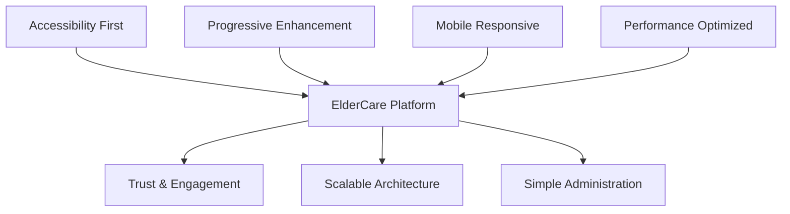
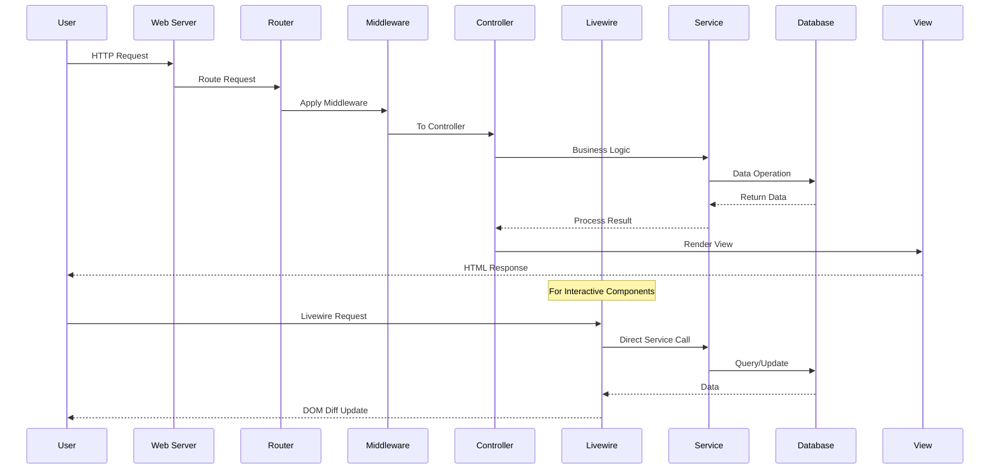
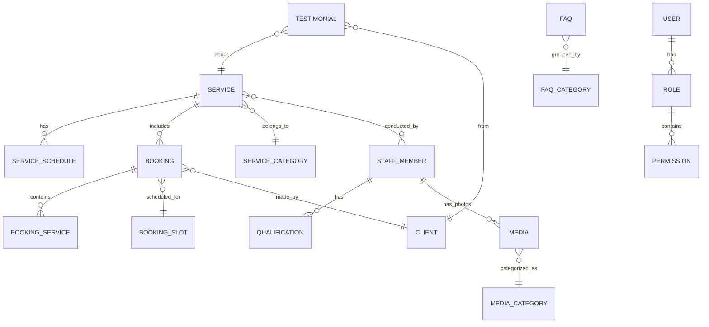
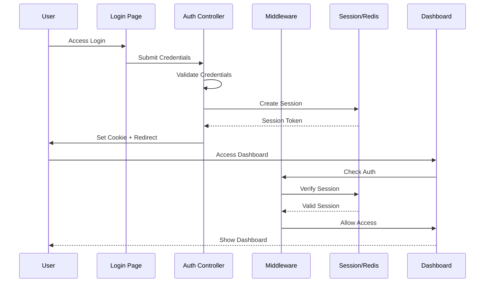
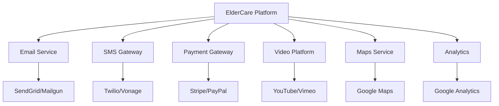

# Deep Analysis: Re-imagining Project Documentation Excellence

## 🎯 Core Philosophy for Exceptional Documentation

After thorough consideration, exceptional project documentation should serve as both a technical compass and an inspiration source. It must:

- **Guide without overwhelming** – Progressive disclosure of complexity  
- **Inspire confidence** – Professional presentation that reflects code quality  
- **Enable autonomy** – Any developer can understand and contribute  
- **Facilitate onboarding** – New team members productive within hours  
- **Serve as truth source** – Always accurate and up-to-date  

## 📊 Documentation Architecture Strategy

```
┌─────────────────────────────────────────────┐
│            README.md (Entry Point)          │
│  - Quick Start (5 min)                      │
│  - Visual Overview                          │
│  - Key Features                             │
└────────────┬────────────────────────────────┘
             │
             ▼
┌─────────────────────────────────────────────┐
│     Project Architecture Document (PAD)     │
│  - Deep Technical Dive                      │
│  - Design Decisions                         │
│  - Patterns & Principles                    │
└────────────┬────────────────────────────────┘
             │
             ▼
┌─────────────────────────────────────────────┐
│         Supporting Documents                 │
│  - API Documentation                        │
│  - Deployment Guide                         │
│  - Contributing Guidelines                  │
└─────────────────────────────────────────────┘
```

## 📋 Meticulous Planning for Document Creation

### README.md Structure Plan

**Hero Section**  
- Project title with tagline  
- Beautiful banner/logo  
- Key badges (build status, version, license)  
- One-paragraph elevator pitch  

**Visual Hook**  
- Screenshots/GIF demo  
- Live demo link  
- Video walkthrough link  

**Quick Start (5-minute setup)**  
- Prerequisites check  
- Clone and run commands  
- Verification steps  

**Features Showcase**  
- Core features with icons  
- Unique selling points  
- Technology highlights  

**Documentation Hub**  
- Links to all resources  
- Quick navigation  

**Technical Overview**  
- Tech stack table  
- Architecture diagram  
- Performance metrics  

**Development Guide**  
- Setup details  
- Common tasks  
- Testing approach  

**Deployment**  
- Production setup  
- Environment variables  
- Monitoring  

**Contributing**  
- How to contribute  
- Code standards  
- Review process  

**Meta Information**  
- License  
- Authors  
- Acknowledgments  

### Project Architecture Document Plan

**Executive Summary**  
- Purpose and vision  
- Key architectural decisions  
- Design principles  

**System Architecture**  
- High-level architecture diagram  
- Component breakdown  
- Data flow diagrams  

**Technical Stack Deep Dive**  
- Technology choices with rationale  
- Trade-offs considered  
- Future considerations  

**Application Architecture**  
- Layer architecture  
- Module structure  
- Design patterns used  

**Data Architecture**  
- Database schema  
- Data models  
- Relationships and constraints  

**Component Architecture**  
- Frontend components  
- Livewire components  
- Service layer  

**Security Architecture**  
- Authentication flow  
- Authorization matrix  
- Security measures  

**Performance Architecture**  
- Caching strategy  
- Optimization techniques  
- Scalability plan  

**Integration Architecture**  
- External services  
- API design  
- Webhook handling  

**Deployment Architecture**  
- Infrastructure diagram  
- CI/CD pipeline  
- Monitoring strategy  

**Development Practices**  
- Coding standards  
- Testing strategy  
- Documentation approach  

**Appendices**  
- Glossary  
- References  
- Decision log  

## 🔍 Review & Validation Checklist

### Consistency Verification
✅ Aligns with PRD vision and goals  
✅ Matches execution plan phases  
✅ Uses same terminology throughout  
✅ Technical details are accurate  
✅ No contradictions between documents  

### Quality Criteria
✅ Clear and concise writing  
✅ Visual elements enhance understanding  
✅ Code examples are functional  
✅ Links are properly formatted  
✅ Sections flow logically  

### Completeness Check
✅ All phases from execution plan referenced  
✅ All technical components documented  
✅ Setup instructions are complete  
✅ Troubleshooting section included  
✅ Contact/support information provided  

## 📚 Project Architecture Document (PAD)

**ElderCare Connect - Technical Architecture Document**  
Version 1.0 | Laravel-Based Elderly Daycare Platform

### 📋 Table of Contents
- Executive Summary  
- System Architecture  
- Technical Stack & Rationale  
- Application Architecture  
- Data Architecture  
- Component Architecture  
- Security Architecture  
- Performance Architecture  
- Integration Architecture  
- Deployment Architecture  
- Development Practices  
- Appendices  

---

### Executive Summary

**Purpose & Vision**  
ElderCare Connect is a modern, accessible web platform designed specifically for elderly daycare centers. The architecture prioritizes accessibility, simplicity, and trust-building while maintaining technical excellence and scalability.

**Key Architectural Decisions**

| Decision | Choice | Rationale |
|----------|--------|-----------|
| Framework | Laravel 12 | Mature ecosystem, excellent documentation, rapid development |
| Frontend Strategy | Livewire + Alpine.js | Reduced complexity, no separate API needed, progressive enhancement |
| Styling | Tailwind CSS | Utility-first, easy accessibility customization, consistent design |
| Database | MariaDB 11.8 | Reliable, performant, excellent Laravel support |
| Caching | Redis | Fast, versatile, supports sessions and cache |
| Media Handling | Spatie MediaLibrary | Robust, well-tested, Laravel-native |
| Deployment | Docker | Consistent environments, easy scaling, portable |

**Core Design Principles**



---

### System Architecture

**High-Level Architecture**

```
┌─────────────────────────────────────────────────────────────────┐
│                         CLIENTS                                 │
├─────────────────────────────────────────────────────────────────┤
│  Elderly Users │ Family Caregivers │ Staff │ Admin │ Partners  │
└───────┬─────────────────────────────────────────────┬───────────┘
        │                                             │
        ▼                                             ▼
┌───────────────────┐                     ┌────────────────────┐
│   Web Browser     │                     │   Mobile Browser   │
│  (Desktop/Tablet) │                     │   (Responsive)     │
└───────┬───────────┘                     └──────────┬─────────┘
        │                                             │
        └──────────────────┬──────────────────────────┘
                           │
                    [HTTPS/SSL]
                           │
        ┌──────────────────▼──────────────────────┐
        │          APACHE WEB SERVER              │
        │         (Reverse Proxy, SSL)            │
        └──────────────────┬──────────────────────┘
                           │
        ┌──────────────────▼──────────────────────┐
        │          LARAVEL APPLICATION            │
        ├──────────────────────────────────────────┤
        │  ┌────────────────────────────────┐     │
        │  │     Presentation Layer         │     │
        │  │  (Controllers, Livewire, Views)│     │
        │  ├────────────────────────────────┤     │
        │  │     Business Logic Layer       │     │
        │  │   (Services, Actions, Jobs)    │     │
        │  ├────────────────────────────────┤     │
        │  │      Data Access Layer         │     │
        │  │  (Models, Repositories, Cache) │     │
        │  └────────────────────────────────┘     │
        └───────────┬────────────┬────────────────┘
                    │            │
        ┌───────────▼──┐    ┌───▼───────────┐
        │   MariaDB    │    │     Redis      │
        │   Database   │    │  Cache/Session │
        └──────────────┘    └────────────────┘
                    │            │
        ┌───────────▼────────────▼────────────┐
        │         File Storage                │
        │     (Local/S3 for Media)            │
        └──────────────────────────────────────┘
```

**Request Flow Architecture**



---

### Technical Stack & Rationale

**Core Technologies**

| Layer | Technology | Version | Rationale |
|-------|------------|---------|-----------|
| Language | PHP | 8.4 | Modern features, performance improvements, strong typing |
| Framework | Laravel | 12.0 | Robust ecosystem, excellent DX, built-in features |
| Database | MariaDB | 11.8 | MySQL compatibility, performance optimizations |
| Cache/Session | Redis | 7.2 | Fast, versatile, pub/sub capabilities |
| Web Server | Apache | 2.4 | Mature, flexible, excellent PHP integration |
| Container | Docker | 24.0 | Consistent environments, easy deployment |

**Frontend Technologies**

| Technology | Purpose | Justification |
|------------|---------|---------------|
| Livewire 3.0 | Reactive UI | No API needed, simple mental model, progressive |
| Alpine.js 3.0 | Client interactivity | Lightweight, perfect with Livewire |
| Tailwind CSS 3.4 | Styling | Utility-first, responsive, accessible defaults |
| Vite | Asset bundling | Fast builds, HMR, modern tooling |

**Supporting Libraries**

```json
{
  "spatie/laravel-medialibrary": "Image/video handling",
  "spatie/laravel-permission": "Role-based access control",
  "barryvdh/laravel-debugbar": "Development debugging",
  "laravel/horizon": "Queue monitoring (future)",
  "sentry/sentry-laravel": "Error tracking (production)",
  "spatie/laravel-sitemap": "SEO sitemap generation",
  "artesaos/seotools": "SEO meta tag management"
}
```

---

### Application Architecture

**Layered Architecture Pattern**

```
┌─────────────────────────────────────────────────────┐
│                PRESENTATION LAYER                    │
│                                                      │
│  ┌──────────┐ ┌──────────┐ ┌──────────┐           │
│  │  Views   │ │ Livewire │ │   API    │           │
│  │ (Blade)  │ │Components│ │(Optional)│           │
│  └──────────┘ └──────────┘ └──────────┘           │
├─────────────────────────────────────────────────────┤
│                APPLICATION LAYER                     │
│                                                      │
│  ┌──────────┐ ┌──────────┐ ┌──────────┐           │
│  │Controllers│ │ Actions  │ │   Jobs   │           │
│  │          │ │          │ │  (Queue) │           │
│  └──────────┘ └──────────┘ └──────────┘           │
├─────────────────────────────────────────────────────┤
│                BUSINESS LOGIC LAYER                  │
│                                                      │
│  ┌──────────┐ ┌──────────┐ ┌──────────┐           │
│  │ Services │ │Calculators│ │Validators│           │
│  │          │ │          │ │          │           │
│  └──────────┘ └──────────┘ └──────────┘           │
├─────────────────────────────────────────────────────┤
│                DATA ACCESS LAYER                     │
│                                                      │
│  ┌──────────┐ ┌──────────┐ ┌──────────┐           │
│  │  Models  │ │Repository│ │  Cache   │           │
│  │(Eloquent)│ │ Pattern  │ │ Manager  │           │
│  └──────────┘ └──────────┘ └──────────┘           │
└─────────────────────────────────────────────────────┘
```

**Module Structure**

```
app/
├── Domain/                    # Domain Logic
│   ├── Booking/
│   │   ├── Actions/
│   │   ├── Models/
│   │   ├── Services/
│   │   └── Repositories/
│   ├── Service/
│   │   ├── Actions/
│   │   ├── Models/
│   │   └── Services/
│   ├── Staff/
│   └── Media/
│
├── Http/                      # HTTP Layer
│   ├── Controllers/
│   │   ├── Admin/
│   │   └── Public/
│   └── Middleware/
│
├── Livewire/                  # Livewire Components
│   ├── Admin/
│   │   ├── BookingManager.php
│   │   └── ServiceEditor.php
│   └── Public/
│       ├── BookingWizard.php
│       └── ServiceExplorer.php
│
└── Support/                   # Helpers & Utilities
    ├── Traits/
    └── Helpers/
```

**Design Patterns Employed**

| Pattern | Usage | Implementation |
|---------|-------|----------------|
| Repository | Data access abstraction | BookingRepository, ServiceRepository |
| Service | Business logic encapsulation | BookingService, MediaService |
| Action | Single-purpose operations | CreateBookingAction, ProcessMediaAction |
| Observer | Model events | BookingObserver, MediaObserver |
| Factory | Object creation | Model factories for testing |
| Singleton | Service instances | Cache manager, Settings service |
| Strategy | Payment processing | Different payment gateways (future) |

---

### Data Architecture

**Entity Relationship Diagram**



**Core Database Schema**

```sql
-- Services Table
CREATE TABLE services (
    id BIGINT UNSIGNED PRIMARY KEY,
    name VARCHAR(255) NOT NULL,
    slug VARCHAR(255) UNIQUE NOT NULL,
    description TEXT,
    short_description VARCHAR(500),
    schedule JSON,
    duration INT,
    capacity INT DEFAULT 20,
    price DECIMAL(10, 2),
    features JSON,
    requirements JSON,
    image_path VARCHAR(500),
    icon VARCHAR(100),
    sort_order INT DEFAULT 0,
    is_featured BOOLEAN DEFAULT FALSE,
    is_active BOOLEAN DEFAULT TRUE,
    meta_title VARCHAR(255),
    meta_description TEXT,
    created_at TIMESTAMP,
    updated_at TIMESTAMP,
    INDEX idx_slug (slug),
    INDEX idx_active_featured (is_active, is_featured),
    INDEX idx_sort (sort_order)
);

-- Bookings Table with Optimizations
CREATE TABLE bookings (
    id BIGINT UNSIGNED PRIMARY KEY,
    booking_number VARCHAR(20) UNIQUE NOT NULL,
    client_name VARCHAR(255) NOT NULL,
    client_email VARCHAR(255) NOT NULL,
    client_phone VARCHAR(20),
    slot_id BIGINT UNSIGNED,
    status ENUM('pending', 'confirmed', 'cancelled') DEFAULT 'pending',
    total_amount DECIMAL(10, 2),
    notes TEXT,
    confirmed_at TIMESTAMP NULL,
    cancelled_at TIMESTAMP NULL,
    created_at TIMESTAMP,
    updated_at TIMESTAMP,
    INDEX idx_status (status),
    INDEX idx_slot (slot_id),
    INDEX idx_email (client_email),
    INDEX idx_booking_number (booking_number)
);
```

**Data Access Patterns**

```php
// Repository Pattern Example
interface BookingRepositoryInterface
{
    public function find(int $id): ?Booking;
    public function findByNumber(string $number): ?Booking;
    public function getUpcoming(int $limit = 10): Collection;
    public function getByDateRange(Carbon $start, Carbon $end): Collection;
    public function store(array $data): Booking;
    public function update(int $id, array $data): bool;
    public function cancel(int $id, string $reason): bool;
}

// Cache Strategy
class CachedServiceRepository implements ServiceRepositoryInterface
{
    public function getActive(): Collection
    {
        return Cache::remember('services.active', 3600, function () {
            return Service::active()
                ->with(['schedules', 'staff'])
                ->orderBy('sort_order')
                ->get();
        });
    }
}
```

---

### Component Architecture

**Livewire Component Structure**

```php
// Example: Booking Wizard Component
namespace App\Livewire\Public;

class BookingWizard extends Component
{
    // State Management
    public int $currentStep = 1;
    public array $steps = [
        1 => 'service-selection',
        2 => 'date-time',
        3 => 'client-info',
        4 => 'special-needs',
        5 => 'confirmation'
    ];
    
    // Form Data
    public array $selectedServices = [];
    public ?string $selectedDate = null;
    public array $clientInfo = [];
    
    // Validation Rules
    protected function rules(): array
    {
        return match($this->currentStep) {
            1 => ['selectedServices' => 'required|array|min:1'],
            2 => ['selectedDate' => 'required|date|after:today'],
            3 => [
                'clientInfo.name' => 'required|string|max:255',
                'clientInfo.email' => 'required|email',
                'clientInfo.phone' => 'required|string'
            ],
            default => []
        };
    }
    
    // Navigation
    public function nextStep(): void
    {
        $this->validate();
        $this->currentStep++;
    }
    
    public function previousStep(): void
    {
        $this->currentStep--;
    }
    
    // Submission
    public function submit(): void
    {
        $this->validate();
        
        DB::transaction(function () {
            $booking = $this->bookingService->create([
                'services' => $this->selectedServices,
                'date' => $this->selectedDate,
                'client' => $this->clientInfo
            ]);
            
            event(new BookingCreated($booking));
            
            $this->redirect(route('booking.confirmation', $booking));
        });
    }
}
```

**Frontend Component Architecture**

```javascript
// Alpine.js Component Example
Alpine.data('mediaGallery', () => ({
    images: [],
    currentIndex: 0,
    isLoading: false,
    filter: 'all',
    
    init() {
        this.loadImages();
        this.initKeyboardNav();
    },
    
    async loadImages() {
        this.isLoading = true;
        try {
            const response = await fetch(`/api/media?filter=${this.filter}`);
            this.images = await response.json();
        } finally {
            this.isLoading = false;
        }
    },
    
    nextImage() {
        this.currentIndex = (this.currentIndex + 1) % this.images.length;
    },
    
    previousImage() {
        this.currentIndex = this.currentIndex === 0 
            ? this.images.length - 1 
            : this.currentIndex - 1;
    },
    
    initKeyboardNav() {
        document.addEventListener('keydown', (e) => {
            if (e.key === 'ArrowRight') this.nextImage();
            if (e.key === 'ArrowLeft') this.previousImage();
            if (e.key === 'Escape') this.closeLightbox();
        });
    }
}));
```

**Blade Component Library**

```blade
{{-- Service Card Component --}}
{{-- resources/views/components/service-card.blade.php --}}
<div class="service-card bg-white rounded-xl shadow-lg overflow-hidden 
            transform transition hover:scale-105 hover:shadow-xl"
     role="article"
     aria-labelledby="service-{{ $service->id }}-title">
    
    @if($service->image_path)
        image_url }}" 
             alt="{{ $service->name }} service"
             class="w-full h-48 object-cover"
             loading="lazy">
    @endif
    
    <div class="p-6">
        <h3 id="service-{{ $service->id }}-title" 
            class="text-2xl font-bold text-gray-800 mb-2">
            {{ $service->name }}
        </h3>
        
        <p class="text-gray-600 mb-4 text-lg">
            {{ $service->short_description }}
        </p>
        
        <div class="flex items-center justify-between">
            <span class="text-2xl font-semibold text-primary">
                ${{ number_format($service->price, 2) }}
            </span>
            
            <a href="{{ route('services.show', $service) }}"
               class="btn-primary"
               aria-label="Learn more about {{ $service->name }}">
                Learn More
                <x-icon name="arrow-right" class="ml-2" />
            </a>
        </div>
    </div>
</div>
```

---

### Security Architecture

**Authentication & Authorization Flow**



**Security Measures Implementation**

```php
// Security Configuration
return [
    'authentication' => [
        'session_timeout' => 30, // minutes
        'max_attempts' => 5,
        'lockout_time' => 15, // minutes
        'two_factor' => env('ENABLE_2FA', false),
    ],
    
    'passwords' => [
        'min_length' => 12,
        'require_uppercase' => true,
        'require_numbers' => true,
        'require_symbols' => true,
        'expires_days' => 90,
    ],
    
    'headers' => [
        'X-Frame-Options' => 'SAMEORIGIN',
        'X-Content-Type-Options' => 'nosniff',
        'X-XSS-Protection' => '1; mode=block',
        'Strict-Transport-Security' => 'max-age=31536000',
        'Content-Security-Policy' => "default-src 'self'",
    ],
    
    'uploads' => [
        'max_size' => 10485760, // 10MB
        'allowed_images' => ['jpg', 'jpeg', 'png', 'gif', 'webp'],
        'allowed_videos' => ['mp4', 'webm', 'mov'],
        'scan_viruses' => true,
    ],
];
```

**Role-Based Access Control Matrix**

| Role | Permissions | Scope |
|------|-------------|-------|
| Super Admin | All permissions | System-wide |
| Admin | Manage content, bookings, users | Facility-wide |
| Content Manager | Create/edit content, media | Content only |
| Booking Manager | Manage bookings, slots | Bookings only |
| Staff | View bookings, edit own profile | Limited |
| Client | View own bookings, resources | Personal only |

---

### Performance Architecture

**Caching Strategy**

```php
// Multi-Level Caching Strategy
class CacheManager
{
    // Level 1: Application Cache (Redis)
    public function remember(string $key, int $ttl, Closure $callback)
    {
        return Cache::store('redis')->remember($key, $ttl, $callback);
    }
    
    // Level 2: Database Query Cache
    public function queryCache(string $key, Builder $query, int $ttl = 3600)
    {
        return $this->remember($key, $ttl, fn() => $query->get());
    }
    
    // Level 3: View Fragment Cache
    public function fragment(string $key, int $ttl, Closure $view)
    {
        if ($cached = $this->get($key)) {
            return $cached;
        }
        
        $content = $view();
        $this->put($key, $content, $ttl);
        return $content;
    }
    
    // Cache Invalidation
    public function invalidate(array $tags)
    {
        Cache::tags($tags)->flush();
    }
}
```

**Performance Optimization Techniques**

```php
// Query Optimization
class OptimizedServiceRepository
{
    public function getWithRelations()
    {
        return Service::query()
            ->select(['id', 'name', 'slug', 'price', 'image_path'])
            ->with([
                'schedules:id,service_id,day,start_time,end_time',
                'staff:id,name,title,photo_path'
            ])
            ->withCount('bookings')
            ->active()
            ->get();
    }
}

// Image Optimization Pipeline
class ImageOptimizer
{
    public function optimize(UploadedFile $file): array
    {
        return [
            'original' => $this->store($file),
            'large' => $this->resize($file, 1200, 800),
            'medium' => $this->resize($file, 600, 400),
            'thumbnail' => $this->resize($file, 300, 200),
            'webp' => $this->convertToWebP($file),
        ];
    }
}
```

**Performance Metrics & Monitoring**

```yaml
Performance Targets:
  - Page Load: < 2s (mobile), < 1.5s (desktop)
  - First Contentful Paint: < 1s
  - Time to Interactive: < 2.5s
  - Largest Contentful Paint: < 2s
  - Cumulative Layout Shift: < 0.05
  - Database Query Time: < 100ms average
  - API Response Time: < 200ms average
  
Monitoring Stack:
  - Application: Laravel Telescope (dev), Sentry (prod)
  - Infrastructure: Docker stats, cAdvisor
  - Database: MariaDB slow query log
  - Cache: Redis INFO command
  - Uptime: Pingdom, UptimeRobot
```

---

### Integration Architecture

**External Service Integrations**



**API Design (Future)**

```yaml
API Structure:
  Base URL: https://api.eldercare.com/v1  
  
  Authentication:
    Type: Bearer Token (JWT)
    Header: Authorization: Bearer {token}
  
  Endpoints:
    Services:
      GET /services - List all services
      GET /services/{id} - Get service details
    
    Bookings:
      POST /bookings - Create booking
      GET /bookings/{number} - Get booking status
      PATCH /bookings/{id} - Update booking
      DELETE /bookings/{id} - Cancel booking
    
    Media:
      GET /media - List media items
      GET /media/{id} - Get media details
    
  Response Format:
    Success:
      {
        "status": "success",
        "data": {...},
        "meta": {...}
      }
    
    Error:
      {
        "status": "error",
        "message": "...",
        "errors": {...}
      }
```

---

### Deployment Architecture

**Container Architecture**

```yaml
# docker-compose.production.yml
version: '3.8'

services:
  app:
    image: eldercare/app:latest
    environment:
      - APP_ENV=production
      - APP_DEBUG=false
    volumes:
      - storage:/var/www/html/storage
      - cache:/var/www/html/bootstrap/cache
    deploy:
      replicas: 2
      resources:
        limits:
          cpus: '1'
          memory: 1G
        reservations:
          cpus: '0.5'
          memory: 512M
  
  web:
    image: eldercare/web:latest
    ports:
      - "443:443"
    volumes:
      - ssl:/etc/ssl/certs
    depends_on:
      - app
  
  db:
    image: mariadb:11.8
    environment:
      - MYSQL_ROOT_PASSWORD_FILE=/run/secrets/db_root_password
    volumes:
      - db_data:/var/lib/mysql
      - ./backup:/backup
    deploy:
      placement:
        constraints:
          - node.role == manager
  
  redis:
    image: redis:7.2-alpine
    command: redis-server --appendonly yes
    volumes:
      - redis_data:/data
  
  backup:
    image: eldercare/backup:latest
    environment:
      - BACKUP_SCHEDULE="0 2 * * *"
    volumes:
      - ./backup:/backup
      - db_data:/source/db:ro
      - storage:/source/storage:ro

volumes:
  storage:
  cache:
  db_data:
  redis_data:
  ssl:
  
secrets:
  db_root_password:
    external: true
```

**CI/CD Pipeline**

```yaml
# .github/workflows/deploy.yml
name: Deploy to Production

on:
  push:
    branches: [main]

jobs:
  test:
    runs-on: ubuntu-latest
    steps:
      - uses: actions/checkout@v3
      - name: Setup PHP
        uses: shivammathur/setup-php@v2
        with:
          php-version: '8.4'
      - name: Install Dependencies
        run: composer install
      - name: Run Tests
        run: php artisan test
      - name: Run Security Check
        run: composer audit

  build:
    needs: test
    runs-on: ubuntu-latest
    steps:
      - uses: actions/checkout@v3
      - name: Build Docker Images
        run: |
          docker build -t eldercare/app:${{ github.sha }} -f docker/app/Dockerfile .
          docker build -t eldercare/web:${{ github.sha }} -f docker/web/Dockerfile .
      - name: Push to Registry
        run: |
          docker push eldercare/app:${{ github.sha }}
          docker push eldercare/web:${{ github.sha }}

  deploy:
    needs: build
    runs-on: ubuntu-latest
    steps:
      - name: Deploy to Production
        run: |
          ssh production "cd /opt/eldercare && docker-compose pull && docker-compose up -d"
      - name: Run Migrations
        run: |
          ssh production "docker exec eldercare_app php artisan migrate --force"
      - name: Clear Caches
        run: |
          ssh production "docker exec eldercare_app php artisan cache:clear"
```

---

### Development Practices

**Coding Standards**

```php
// PSR-12 Coding Standard with Custom Rules
<?php

declare(strict_types=1);

namespace App\Domain\Booking\Services;

use App\Domain\Booking\Models\Booking;
use App\Domain\Booking\Exceptions\BookingException;
use Illuminate\Support\Facades\DB;

/**
 * Handles all booking-related business logic
 * 
 * @package App\Domain\Booking\Services
 */
final class BookingService
{
    /**
     * Create a new booking with transaction safety
     * 
     * @param array $data The booking data
     * @return Booking The created booking
     * @throws BookingException If booking cannot be created
     */
    public function create(array $data): Booking
    {
        return DB::transaction(function () use ($data) {
            // Validate slot availability
            $this->validateAvailability($data['slot_id']);
            
            // Create booking
            $booking = Booking::create([
                'booking_number' => $this->generateBookingNumber(),
                'client_name' => $data['client_name'],
                'client_email' => $data['client_email'],
                'slot_id' => $data['slot_id'],
                'status' => Booking::STATUS_PENDING,
            ]);
            
            // Trigger events
            event(new BookingCreated($booking));
            
            return $booking;
        });
    }
    
    /**
     * Generate unique booking number
     * 
     * @return string
     */
    private function generateBookingNumber(): string
    {
        return 'BK' . date('Ymd') . strtoupper(uniqid());
    }
}
```

**Testing Strategy**

```php
// Feature Test Example
namespace Tests\Feature\Booking;

use Tests\TestCase;
use App\Models\Service;
use App\Models\BookingSlot;
use Illuminate\Foundation\Testing\RefreshDatabase;

class BookingWizardTest extends TestCase
{
    use RefreshDatabase;

    /** @test */
    public function user_can_complete_booking_wizard(): void
    {
        // Arrange
        $service = Service::factory()->active()->create();
        $slot = BookingSlot::factory()->available()->create();
        
        // Act - Step 1: Service Selection
        $this->livewire(BookingWizard::class)
            ->set('selectedServices', [$service->id])
            ->call('nextStep')
            ->assertSet('currentStep', 2);
        
        // Act - Step 2: Date Selection
        $this->livewire(BookingWizard::class)
            ->set('selectedDate', now()->addDays(3)->format('Y-m-d'))
            ->call('nextStep')
            ->assertSet('currentStep', 3);
        
        // Act - Step 3: Client Info
        $this->livewire(BookingWizard::class)
            ->set('clientInfo.name', 'John Doe')
            ->set('clientInfo.email', 'john@example.com')
            ->set('clientInfo.phone', '555-0123')
            ->call('submit')
            ->assertRedirect(route('booking.confirmation'));
        
        // Assert
        $this->assertDatabaseHas('bookings', [
            'client_email' => 'john@example.com',
            'status' => 'pending'
        ]);
    }
}
```

**Documentation Standards**

```php
/**
 * Service Repository Interface
 * 
 * Defines the contract for service data access operations.
 * All implementations must adhere to this interface to ensure
 * consistency across different storage mechanisms.
 * 
 * @package App\Domain\Service\Contracts
 * @author ElderCare Development Team
 * @since 1.0.0
 */
interface ServiceRepositoryInterface
{
    /**
     * Retrieve all active services with their relationships
     * 
     * This method returns only services marked as active,
     * eager loads necessary relationships for performance,
     * and orders them by their sort_order field.
     * 
     * @param array $with Optional relationships to eager load
     * @return \Illuminate\Support\Collection<Service>
     * 
     * @example
     * $services = $repository->getActive(['schedules', 'staff']);
     */
    public function getActive(array $with = []): Collection;
}
```

---

### Appendices

**A. Glossary**

| Term | Definition |
|------|------------|
| ADC | Adult Day Care - supervised daytime care for elderly adults |
| Livewire | Full-stack framework for Laravel that makes building dynamic UIs simple |
| Alpine.js | Lightweight JavaScript framework for composing behavior |
| Repository Pattern | Design pattern that encapsulates data access logic |
| Service Layer | Business logic layer that coordinates application operations |
| WCAG | Web Content Accessibility Guidelines |

**B. Technology Decision Log**

| Date | Decision | Rationale | Alternatives Considered |
|------|----------|-----------|--------------------------|
| 2024-01 | Laravel 12 | Latest LTS, mature ecosystem | Symfony, Slim |
| 2024-01 | Livewire | Simplifies reactive UI without separate API | Vue.js, React |
| 2024-01 | MariaDB | MySQL compatibility with better performance | PostgreSQL, MySQL |
| 2024-01 | Redis | Fast caching and sessions | Memcached, File cache |
| 2024-01 | Docker | Consistent environments | Vagrant, bare metal |

**C. References**
- Laravel Documentation  
- Livewire Documentation  
- WCAG Guidelines  
- PHP-FIG Standards  
- Docker Best Practices
